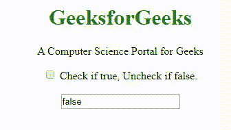
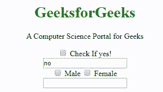

# 如何使用 jQuery 更改复选框值？

> 原文:[https://www . geeksforgeeks . org/如何使用-jquery/](https://www.geeksforgeeks.org/how-to-change-the-checkbox-value-using-jquery/) 更改复选框值

**复选框**用于让用户从有限的选项中选择一个或多个选项。**:复选框**选择器选择带有类型复选框的输入元素。
**语法:**

```
$('#textboxID').val($("#checkboxID").is(':checked'));
```

在上面的语法中，基本上选中或未选中复选框的返回值被分配给文本框。下面的例子将说明这种方法:
**例子 1:** 这里复选框的返回值被分配给文本框，函数**单击()**每当复选框被单击以选中或取消选中时，它将相应的返回值分配给文本框。因此，如果我们想根据 check 在文本框中分配某个用户定义的值，那么我们可以使用 **if/else** 语句来实现。

## 超文本标记语言

```
<!DOCTYPE html>
<html>

<head>
    <script src=
"https://ajax.googleapis.com/ajax/libs/jquery/3.4.1/jquery.min.js">
    </script>

    <script>
        $(document).ready(function() {

            // Set initial state
            $('#textbox2').val($(this).is(':checked'));

            // It gets checked to false as uncheck
            // is the default
            $('#checkbox1').click(function() {
                $('#textbox2').val($(this).is(':checked'));
            });
        });
    </script>
</head>

<body>
    <center>
        <h1 style="color:green;">
            GeeksforGeeks
        </h1>

<p>
            A Computer Science
            Portal for Geeks
        </p>

        <input type="checkbox" id="checkbox1" />
        Check if true, Uncheck if false.

        <br><br>

        <input type="text" id="textbox2" />
    </center>
</body>

</html>
```

**输出:**



**示例 2:** 该示例包含多个复选框。

## java 描述语言

```
<!DOCTYPE html>
<html>

<head>
    <script src=
"https://ajax.googleapis.com/ajax/libs/jquery/2.1.1/jquery.min.js">
    </script>

    <script>
        $(document).ready(function() {

            // Set initial state
            $('#textbox1').val('no');

            // Returns yes or no in textbox1
            // when checked and unchecked
            $('#checkbox1').click(function() {
                if ($("#checkbox1").is(":checked") == true) {
                    $('#textbox1').val('yes');
                } else {
                    $('#textbox1').val('no');
                }
            });

            // Returns male in textbox2 if checkbox2 checked.
            $('#checkbox2').click(function() {
                if ($('#checkbox2').is(":checked") == true) {
                    $('#textbox2').val('Male');
                } else {
                    $('#textbox2').val('');
                }
            });

            // Returns female in textbox2
            // if checkbox2 checked.
            $('#checkbox3').change(function() {
                if ($('#checkbox3').is(":checked") == true) {
                    $('#textbox2').val('Female');
                } else {
                    $('#textbox2').val('');
                }
            });
        });
    </script>
</head>

<body>
    <center>
        <h1 style="color:green">
            GeeksforGeeks
        </h1>

<p>
            A Computer Science
            Portal for Geeks
        </p>

        <input type="checkbox" id="checkbox1" />
        Check If yes!
        <br>

        <input type="text" id="textbox1" />
        <br>

        <input type="checkbox" id="checkbox2" /> Male
        <input type="checkbox" id="checkbox3" /> Female
        <br>

        <input type="text" id="textbox2" />
    </center>
</body>

</html>
```

**输出:**



jQuery 是一个开源的 JavaScript 库，它简化了 HTML/CSS 文档之间的交互，它以其“少写多做”的理念而闻名。
跟随本 [jQuery 教程](https://www.geeksforgeeks.org/jquery-tutorials/)和 [jQuery 示例](https://www.geeksforgeeks.org/jquery-examples/)可以从头开始学习 jQuery。