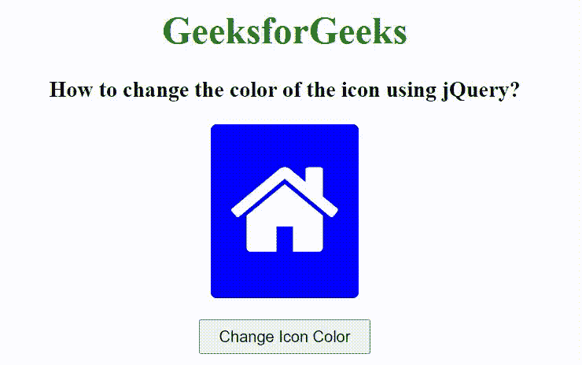

# 如何使用 jQuery 改变图标的颜色？

> 原文:[https://www . geeksforgeeks . org/如何使用-jquery/](https://www.geeksforgeeks.org/how-to-change-the-color-of-an-icon-using-jquery/) 更改图标颜色

在本文中，我们将看到如何使用 jQuery 更改图标的颜色。为了改变图标的颜色，我们将使用 jquery 方法。

[jQuery css()方法](https://www.geeksforgeeks.org/jquery-css-method/)该方法用于更改特定选择器的样式。这个方法也可以用来改变图标的颜色。首先，我们将使用字体创建一个图标元素，并使用 CSS 属性在上面添加一些样式。我们添加了一个 HTML 按钮，当点击按钮时，会调用 css()方法，并在图标元素上添加一些颜色和背景色。

**语法:**

```
$(selector).css(property)
```

**返回值**:返回所选元素的属性值。

**示例:**

## 超文本标记语言

```
<!DOCTYPE html>
<html>

<head>
    <title>
        How to change the color of the icon using jQuery?
    </title>
    <script src=
"https://ajax.googleapis.com/ajax/libs/jquery/3.3.1/jquery.min.js">
    </script>
    <link rel="stylesheet" 
          href=
"https://cdnjs.cloudflare.com/ajax/libs/font-awesome/4.7.0/css/font-awesome.min.css">
    <style>
        .btn {
            background-color: blue;
            border: none;
            color: white;
            padding: 16px 16px;
            font-size: 100px;
            border-radius: 5px;
        }

        #append {
            padding: 5px 15px;
        }
    </style>
    <!-- Script to add div element 
         in the HTML document -->
    <script>
        $(document).ready(function () {
            $("button").click(function () {
                $(".btn").css({
                    backgroundColor: "green",
                    color: "yellow"
                });
            });
        });
    </script>

</head>

<body>

    <center>
        <h1 style="color: green;">
            GeeksforGeeks
        </h1>

        <h3>
            How to change the color of the icon using jQuery?
        </h3>

        <button class="btn">
            <i class="fa fa-home"></i>
        </button>

        <br><br>

        <button id="append">
            Change Icon Color
        </button>

    </center>
</body>

</html>
```

**输出:**

