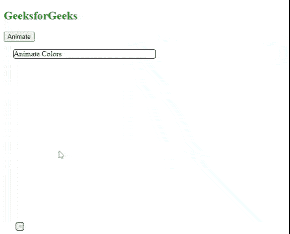

# 如何更改任何使用 jQuery 制作动画的 div 的颜色？

> 原文:[https://www . geeksforgeeks . org/如何使用 jquery/](https://www.geeksforgeeks.org/how-to-change-the-color-of-any-div-that-is-animated-using-jquery/) 更改任何动画分区的颜色

在本文中，我们将学习更改任何使用 jQuery 制作动画的 HTML [*div*](https://www.geeksforgeeks.org/div-tag-html/) 的颜色。

我们将使用 [](https://www.geeksforgeeks.org/jquery-animate-with-examples/) 这个 jQuery [*。animate()*](https://www.geeksforgeeks.org/jquery-animate-with-examples/) 方法改变任何元素的背景颜色。使用此方法的语法如下。

**语法:**

```html
(selector).animate({css styles},speed,easing,callback)
```

CSS 样式定义了 CSS 属性，如*背景色、填充、边距*等。速度指定动画的速度，默认为 400 毫秒。选项*缓和*指定动画不同点的元素速度，例如，*摆动或线性。*回调是动画完成后要执行的功能。

**示例:**以下示例有助于更改任何已动画化的 *div* 的颜色。

## 超文本标记语言

```html
<!DOCTYPE html>
<html>
  <head>
    <script src=
"https://ajax.googleapis.com/ajax/libs/jquery/1.7.1/jquery.min.js">
    </script>
    <script src=
"https://ajax.googleapis.com/ajax/libs/jqueryui/1.9.1/jquery-ui.min.js">
    </script>
    <style>
      div {
        width: 300px;
        border: solid 1px black;
        border-radius: 5px;
        margin-left: 20px;
      }
    </style>
  </head>
  <body>
    <h2 style="color: green">GeeksforGeeks</h2>

    <p>
      <input type="button" id="btn1" value="Animate" />
    </p>

    <div id="div">Animate Colors</div>
    <script>
      var animate = true;
      $("#btn1").click(function () {

        // Changing the background color alongwith
        // changing width of the div tag
        if (animate)
          $("#div").animate({ "background-color": "red", 
                               width: "200px" }, 800);
        else
          $("#div").animate(
            { "background-color": "green", 
               width: "300px" },
            800
          );

        animate = !animate;
      });
    </script>
  </body>
</html>
```

**输出:**

