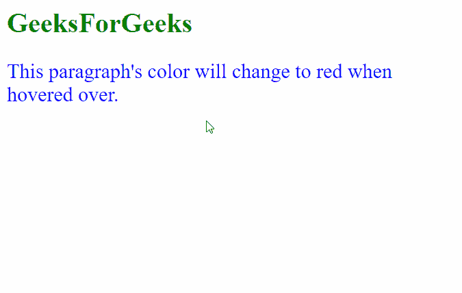

# 如何使用 jQuery 在鼠标悬停事件中将任意段落的颜色更改为红色？

> 原文:[https://www . geeksforgeeks . org/如何使用-jquery 将任何段落的颜色更改为鼠标悬停事件上的红色/](https://www.geeksforgeeks.org/how-to-change-the-color-of-any-paragraph-to-red-on-mouseover-event-using-jquery/)

在本文中，我们将学习如何在鼠标悬停事件中将任何段落的颜色更改为红色。

**方法:**这可以通过使用 jQuery 的**[(on)](https://www.geeksforgeeks.org/jquery-on-with-examples/)**方法在鼠标悬停事件上附加事件处理函数来实现。当用户将光标悬停在任何段落上时，将触发此事件。on()方法中的处理程序被定义为一个匿名函数，它使用 jQuery 中的 **[css()](https://www.geeksforgeeks.org/jquery-css-method/)** 方法来更改段落的 CSS 样式。它使用*这个*绑定应用红色，从而将被点击段落的颜色变为红色。

**语法:**

```html
$("p").on("mouseover", function() {
    $(this).css("color", "red");
});
```

**示例:**在本例中，只要用户将鼠标悬停在段落元素上，段落元素就会变为红色。

## 超文本标记语言

```html
<html>
<head>
  <script src=
"https://code.jquery.com/jquery-git.js">
  </script>
  <style>
    p {
      color:blue;
      font-size: 24px
    }
  </style>
</head>

<body>
  <h1 style="color: green;">
    GeeksForGeeks
  </h1>
  <p>
    This paragraph's color will change
    to red when hovered over.
  </p>

  <script>

    // Add the mouseover event handler to
    // the paragraph element
    $("p").on("mouseover", function () {

      // Set the text color of 
      // this element to red
      $(this).css("color", "red");
    });
  </script>
</body>
</html>
```

**输出:**

