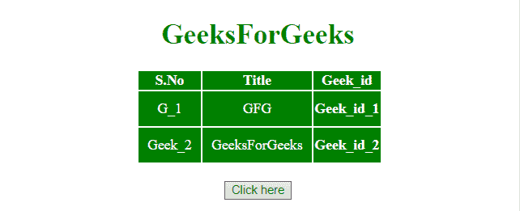
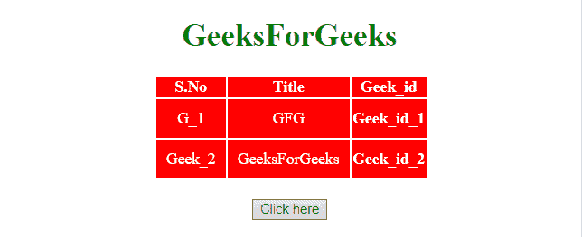

# 如何使用 jQuery 更改元素 id？

> 原文:[https://www . geeksforgeeks . org/如何使用-jquery/](https://www.geeksforgeeks.org/how-to-change-the-element-id-using-jquery/) 更改元素 id

jQuery 方法用于更改**元素标识**，描述如下:

*   **jQuery attr() Method:** This method set/return attributes and values of the selected elements. If this method is used to return the attribute value, it returns the value of first selected element. If this method is used to set attribute values, it sets one or more than one attribute/value pairs for the set of selected elements.

    **语法:**

    *   **返回属性的值:**

        ```html
        $(selector).attr(attribute)

        ```

    *   **设置属性和值:**

    ```html
    $(selector).attr(attribute, value)

    ```

*   **使用功能设置属性和值:**

    ```html
    $(selector).attr(attribute, function(index, currentvalue))

    ```

*   **设置多个属性和值:**

    ```html
    $(selector).attr({attribute:value, attribute:value, ...})

    ```

**参数:**

*   **属性:**此参数指定属性的名称。
*   **值:**该参数指定属性的值。
*   **函数(索引，currentvalue):** 此参数指定一个返回要设置的属性值的函数。
    *   **索引:**该参数接收集合中元素的索引位置。
    *   **当前值:**此参数接收所选元素的当前属性值。

*   **jQuery prop() Method:** This method set/return properties and values of the matched elements. If this method is used to return the property value, it returns the value of the first selected element. If this method is used to set property values, it sets one or more property/value pairs for the set of selected elements.

    **语法:**

    *   **返回房产价值:**

        ```html
        $(selector).prop(property)

        ```

    *   **设置属性和值:**

        ```html
        $(selector).prop(property, value)

        ```

    *   **使用函数设置属性和值:**

    ```html
    $(selector).prop(property, function(index, currentvalue))

    ```

    *   **Set multiple properties and values:**

    ```html
    $(selector).prop({property:value, property:value, ...})

    ```

    **参数:**

    *   **属性:**此参数指定属性的名称。
    *   **值:**此参数指定属性的值。
    *   **函数(索引，currentvalue):** 此参数指定一个返回要设置的属性值的函数。
        *   **索引:**该参数接收集合中元素的索引位置。
        *   **当前值:**此参数接收选定元素的当前属性值。

    **示例 1:** 本示例使用 **attr()方法**更改元素的 **ID** 并将背景颜色更改为红色。

    ```html
    <!DOCTYPE HTML> 
    <html> 
        <head> 
            <title> 
                Change the element ID
            </title> 

            <script src =
    "https://ajax.googleapis.com/ajax/libs/jquery/3.4.0/jquery.min.js">
            </script>

            <style>
                #myCol {
                    background: green;
                }
                #newID {
                    background: red;
                }
                table {
                    color: white;
                }
                td {
                    padding: 10px;
                }
            </style>
        </head> 

        <body>
            <center>     
                <h1 style = "color:green;" > 
                    GeeksForGeeks 
                </h1>    

                <table>
                    <colgroup>
                        <col id= "myCol"
                            span= "3">
                        <col style= "background-color:green">
                    </colgroup>

                    <tr>
                        <th>S.No</th>
                        <th>Title</th>
                        <th>Geek_id</th>
                    </tr>
                    <tr id = "row1">
                        <td>G_1</td>
                        <td>GFG</td>
                        <th>Geek_id_1</th>
                    </tr>
                    <tr>
                        <td>Geek_2</td>
                        <td>GeeksForGeeks</td>
                        <th>Geek_id_2</th>
                    </tr>
                </table>
                <br>

                <button onclick = "Geeks()"> 
                    Click here
                </button> 

                <script> 
                    function Geeks() {
                            $("col").attr('id', 'newID');
                    }
                </script> 
            </center>
        </body> 
    </html>                    
    ```

    **输出:**

    *   **点击按钮前:**
        
    *   **点击按钮后:**
        

    **示例 2:** 本示例使用 **prop()方法**更改元素的 **ID** 并将背景颜色更改为红色。

    ```html
    <!DOCTYPE HTML> 
    <html> 
        <head> 
            <title> 
                Change the element ID
            </title> 

            <script src = 
    "https://ajax.googleapis.com/ajax/libs/jquery/3.4.0/jquery.min.js">
            </script>

            <style>
                #myCol {
                    background: green;
                }
                #newID {
                    background: red;
                }
                table {
                    color: white;
                }
                td {
                    padding: 10px;
                }
            </style>
        </head> 

        <body>
            <center>     
                <h1 style = "color:green;" > 
                    GeeksForGeeks 
                </h1>

                <table>
                    <colgroup>
                        <col id= "myCol"
                            span= "3">
                        <col style= "background-color:green">
                    </colgroup>

                    <tr>
                        <th>S.No</th>
                        <th>Title</th>
                        <th>Geek_id</th>
                    </tr>
                    <tr id = "row1">
                        <td>G_1</td>
                        <td>GFG</td>
                        <th>Geek_id_1</th>
                    </tr>
                    <tr>
                        <td>Geek_2</td>
                        <td>GeeksForGeeks</td>
                        <th>Geek_id_2</th>
                    </tr>
                </table>
                <br>

                <button onclick = "Geeks()"> 
                    Click here
                </button> 

                <script> 
                    function Geeks() {
                        $("col").prop('id', 'newID');
                    }
                </script> 
            </center>
        </body> 
    </html>                    
    ```

    **输出:**

    *   **点击按钮前:**
        
    *   **点击按钮后:**
        