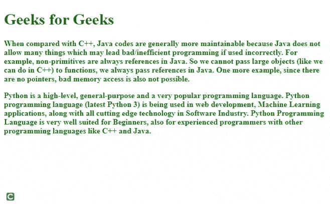

# 如何使用 jQuery 改变 mouseenter 和 mouseleave 上段落的字体样式？

> 原文:[https://www . geeksforgeeks . org/如何使用-jquery/](https://www.geeksforgeeks.org/how-to-change-the-font-styles-of-paragraphs-on-mouseenter-and-mouseleave-using-jquery/) 更改鼠标输入和鼠标离开时段落的字体样式

jQuery 是强大的 JavaScript 库之一，它有许多强大的方法，使得使用选择器操作 DOM 变得更加简单。

在本文中，让我们看看如何使用 jQuery 改变鼠标进入和离开时段落的字体粗细和颜色。

**方法:**使用 jQuery，我们可以在 [DOM 事件](https://www.geeksforgeeks.org/javascript-events/)期间添加许多功能。我们可以使用 jQuery 添加 CSS 动画，如隐藏、显示和许多其他效果。

我们可以在 [mouseenter](https://www.geeksforgeeks.org/jquery-mouseenter-with-examples/) 事件上使用 [**addClass()**](https://www.geeksforgeeks.org/javascript-adding-a-class-name-to-the-element/) 方法添加包含 CSS 的类，并在 [mouseleave](https://www.geeksforgeeks.org/jquery-mouseleave-with-examples/) 事件上使用[**remove CLaSS()**](https://www.geeksforgeeks.org/jquery-removeclass-with-examples/)**移除类，方法是使用选择器选择 *p* 标记。**

****方法 1:** 在 mouseenter 和 mouseleave 事件上添加单个函数。**

****语法:****

```html
$('selector').eventname(function())
```

## **超文本标记语言**

```html
<!DOCTYPE html>
<html lang="en">

<head>
    <meta charset="UTF-8" />
    <meta http-equiv="X-UA-Compatible" content="IE=edge" />
    <meta name="viewport" content=
        "width=device-width, initial-scale=1.0" />

    <!-- Including jQuery  -->
    <script src=
"https://code.jquery.com/jquery-3.6.0.min.js"
        integrity=
"sha256-/xUj+3OJU5yExlq6GSYGSHk7tPXikynS7ogEvDej/m4="
        crossorigin="anonymous">
    </script>

    <style>
        h1 {
            color: #006600;
        }

        /* Changes the div's background 
        color to red */
        .adder {
            color: #006600;
            font-weight: bold;
        }
    </style>
</head>

<body>
    <h1>Geeks for Geeks</h1>

    <p>
        When compared with C++, Java codes are 
        generally more maintainable because Java 
        does not allow many things which may 
        lead bad/inefficient programming if used
        incorrectly. For example, non-primitives 
        are always references in Java. So we 
        cannot pass large objects(like we can do 
        in C++) to functions, we always pass
        references in Java. One more example, 
        since there are no pointers, bad memory 
        access is also not possible.
    </p>

    <p>
        Python is a high-level, general-purpose 
        and a very popular programming language.
        Python programming language (latest 
        Python 3) is being used in web development,
        Machine Learning applications, along with 
        all cutting edge technology in Software 
        Industry. Python Programming Language is 
        very well suited for Beginners, also for 
        experienced programmers with other 
        programming languages like C++ and Java.
    </p>

    <script>
        $(document).ready(function () {
            $("p").mouseenter(function () {
                $("p").addClass("adder");
            });
            $("p").mouseleave(function () {
                $("p").removeClass("adder");
            });
        });
    </script>
</body>

</html>
```

****输出:****

****

****方法二:**使用 [**on()**](https://www.geeksforgeeks.org/jquery-on-with-examples/) 方法搭配多个事件。**

****语法:****

```html
 $('selector').on({
    event1:function () {
        // Code
    },
    event2:function () {
        // Code
    }
})
```

## **超文本标记语言**

```html
<!DOCTYPE html>
<html lang="en">

<head>
    <meta charset="UTF-8" />
    <meta http-equiv="X-UA-Compatible" 
        content="IE=edge" />
    <meta name="viewport" content=
        "width=device-width, initial-scale=1.0" />

    <!-- Including jQuery  -->
    <script src=
"https://code.jquery.com/jquery-3.6.0.min.js"
        integrity=
"sha256-/xUj+3OJU5yExlq6GSYGSHk7tPXikynS7ogEvDej/m4="
        crossorigin="anonymous">
    </script>

    <style>
        h1 {
            color: #006600;
        }

        /* Changes the div's background 
        color to red */
        .adder {
            color: #006600;
            font-weight: bold;
        }
    </style>
</head>

<body>
    <h1>Geeks for Geeks</h1>

    <p>
        When compared with C++, Java codes are
        generally more maintainable because Java
        does not allow many things which may
        lead bad/inefficient programming if used
        incorrectly. For example, non-primitives
        are always references in Java. So we
        cannot pass large objects(like we can do
        in C++) to functions, we always pass
        references in Java. One more example,
        since there are no pointers, bad memory
        access is also not possible.
    </p>

    <p>
        Python is a high-level, general-purpose
        and a very popular programming language.
        Python programming language (latest
        Python 3) is being used in web development,
        Machine Learning applications, along with
        all cutting edge technology in Software
        Industry. Python Programming Language is
        very well suited for Beginners, also for
        experienced programmers with other
        programming languages like C++ and Java.
    </p>

    <script>
        $(document).ready(function () {
            $("p").on({
                mouseenter: function () {
                    $("p").addClass("adder");
                },
                mouseleave: function () {
                    $("p").removeClass("adder");
                },
            });
        });
    </script>
</body>

</html>
```

****输出:****

****

****方法 3:** 对所选元素的*鼠标输入*和*鼠标离开*事件应用 CSS 方法。**

## **超文本标记语言**

```html
<!DOCTYPE html>
<html lang="en">

<head>
    <meta charset="UTF-8" />
    <meta http-equiv="X-UA-Compatible" content="IE=edge" />
    <meta name="viewport" content=
        "width=device-width, initial-scale=1.0" />

    <!-- Including jQuery  -->
    <script src=
"https://code.jquery.com/jquery-3.6.0.min.js"
        integrity=
"sha256-/xUj+3OJU5yExlq6GSYGSHk7tPXikynS7ogEvDej/m4=" 
        crossorigin="anonymous">
    </script>

    <style>
        h1 {
            color: #006600;
        }

        /* Changes the div's background 
        color to red */
        .adder {
            color: #006600;
            font-weight: bold;
        }
    </style>
</head>

<body>
    <h1>Geeks for Geeks</h1>

    <p>
        When compared with C++, Java codes are
        generally more maintainable because Java
        does not allow many things which may
        lead bad/inefficient programming if used
        incorrectly. For example, non-primitives
        are always references in Java. So we
        cannot pass large objects(like we can do
        in C++) to functions, we always pass
        references in Java. One more example,
        since there are no pointers, bad memory
        access is also not possible.
    </p>

    <p>
        Python is a high-level, general-purpose
        and a very popular programming language.
        Python programming language (latest
        Python 3) is being used in web development,
        Machine Learning applications, along with
        all cutting edge technology in Software
        Industry. Python Programming Language is
        very well suited for Beginners, also for
        experienced programmers with other
        programming languages like C++ and Java.
    </p>

    <script>
        $(document).ready(function () {
            $("p").on({
                mouseenter: function () {

                    // Changing css on mouseenter event
                    $("p").css({ 
                        color: "#006600", 
                        "font-weight": "bold" 
                    });
                },
                mouseleave: function () {

                    // Changing css on mouseleave event
                    $("p").css({ 
                        color: "black", 
                        "font-weight": "normal" 
                    });
                },
            });
        });
    </script>
</body>

</html>
```

****输出:****

****