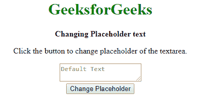
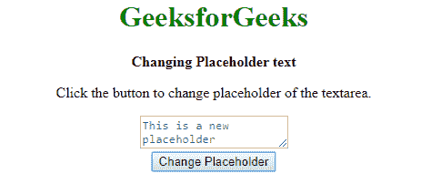

# 如何使用 jQuery 更改占位符文本？

> 原文:[https://www . geeksforgeeks . org/如何使用-jquery/](https://www.geeksforgeeks.org/how-to-change-the-placeholder-text-using-jquery/) 更改占位符文本

占位符文本是用户输入的文本输出。像在 HTML 中一样，我们使用名称作为输入字段，并在该空间中放置一个文本，即输入您的姓名。如下图所示:

名称:<input placeholder="Enter your name" disable="true" disabled="disabled">

因此，我们需要一个按钮或一些事件，将占位符文本更改为其他文本。为此，我们有下面描述的两种方法:

**方法 1:** 在这个方法中我们将使用 [**attr()**](https://www.geeksforgeeks.org/jquery-attr-method/) 方法。 **attr()** 方法用于设置或返回所选元素的指定属性。它需要两个参数，第一个是要设置的属性，第二个是要更改为的属性值。

**“占位符”**属性控制将在输入区域显示为占位符的文本。该属性作为第一个参数传递给 **attr()** 方法。需要设置的文本作为第二个参数传递。这会将元素的占位符文本更改为新文本。

*   **语法:**

    ```
    $('selectedTextarea').attr('placeholder', 'Placeholder text');
    ```

*   **例:**

    ```
    <!DOCTYPE html>
    <html>
    <head>
        <title>
            Changing Placeholder text
        </title>
        <style>
            body {
                text-align: center;
            }
        </style>
    </head>

    <body>
        <h1 style="color: green;">
         GeeksforGeeks
        </h1>
        <b>
         Changing Placeholder text
        </b>
        <p>
          Click the button to change placeholder 
          of the textarea.
        </p>
        <textarea id="area1" placeholder="Default Text"></textarea>
        <br>
        <button onclick="changePlaceholder()">
            Change Placeholder
        </button>

        <script src="https://code.jquery.com/jquery-3.4.1.min.js">
        </script>
        <script type="text/javascript">
            function changePlaceholder() {
                $('#area1').attr('placeholder',
                    'This is a new placeholder');
            }
        </script>
    </body>

    </html>
    ```

*   **输出:**
    *   **点击按钮前:**
        
    *   **点击按钮后:**
        

**方法 2:** 使用占位符属性。“占位符”属性用于获取或设置输入文本的占位符。这可用于将占位符文本更改为新文本。首先使用 jQuery 选择器选择元素。然后，可以将新的占位符文本分配给元素的占位符属性。这会将元素的占位符文本更改为新文本。

*   **语法:**

    ```
    selectedTextarea = $('selectedTextarea')[0];
    selectedTextarea.placeholder = "Placeholder text";
    ```

*   **例:**

    ```
    <!DOCTYPE html>
    <html>

    <head>
        <title>
            Changing Placeholder text
        </title>
        <style>
            body {
                text-align: center;
            }
        </style>
    </head>

    <body>
        <h1 style="color: green;">
         GeeksforGeeks
        </h1>
        <b>
         Changing Placeholder text
        </b>
        <p>
         Click the button to change placeholder 
         of the textarea.
        </p>
        <textarea id="area1" placeholder="Default Text"></textarea>
        <br>
        <button onclick="changePlaceholder()">
            Change Placeholder
        </button>

        <script src="https://code.jquery.com/jquery-3.4.1.min.js">
        </script>
        <script type="text/javascript">
            function changePlaceholder() {
                selectedTextarea = $('#area1')[0];

                selectedTextarea.placeholder =
                    "This is a new placeholder";
            }
        </script>
    </body>

    </html>
    ```

*   **输出:**
    *   **点击按钮前:**
        
    *   **点击按钮后:**
        

jQuery 是一个开源的 JavaScript 库，它简化了 HTML/CSS 文档之间的交互，它以其“少写多做”的理念而闻名。
跟随本 [jQuery 教程](https://www.geeksforgeeks.org/jquery-tutorials/)和 [jQuery 示例](https://www.geeksforgeeks.org/jquery-examples/)可以从头开始学习 jQuery。