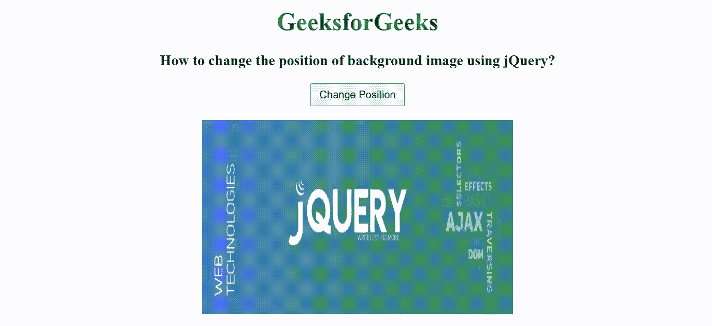

# 如何使用 jQuery 改变背景图像的位置？

> 原文:[https://www . geeksforgeeks . org/如何使用-jquery/](https://www.geeksforgeeks.org/how-to-change-the-position-of-background-image-using-jquery/) 更改背景图像的位置

在本文中，我们将看到如何使用 jQuery 更改背景图像的位置。要更改背景图像的位置，我们将使用带有 float 属性的 css()方法。

[**css()方法**](https://www.geeksforgeeks.org/jquery-css-method/) 用于更改所选元素的样式属性。float 属性用于更改元素的正常流动。它定义了一个元素应该如何浮动，并将一个元素放在其容器的右侧或左侧。

**语法:**

```html
$(selector).css(float: position)
```

**返回值**:返回所选元素的属性值。

在下面的例子中，我们已经创建了一个图像元素和一个按钮。当用户单击按钮时，会调用 jQuery css()方法，并在图像上应用 float 属性来更改其位置。

**示例:**

## 超文本标记语言

```html
<!DOCTYPE html>
<html>

<head>
    <title>
        How to change the position of 
        background image using jQuery?
    </title>

    <script src=
"https://ajax.googleapis.com/ajax/libs/jquery/3.3.1/jquery.min.js">
    </script>

    <script>
        $(document).ready(function() {
            $("#position").on('click', function() {
                $("img").css({
                    float: "left",
                      paddingLeft: "200px"
                });
            });
        });
    </script>
</head>

<body>
    <center>
        <h1 style="color: green;">
            GeeksforGeeks
        </h1>

        <h3>
            How to change the position of 
            background image using jQuery?
        </h3>

        <input type="button" id="position" 
            value="Change Position" 
            style="padding: 5px 10px;">
        <br><br>

        
    </center>
</body>

</html>
```

**输出:**

