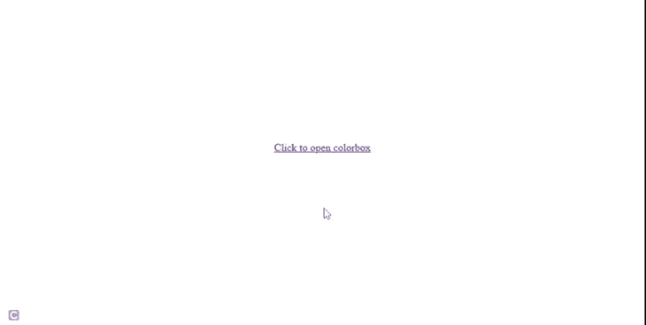
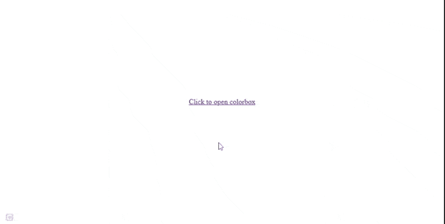
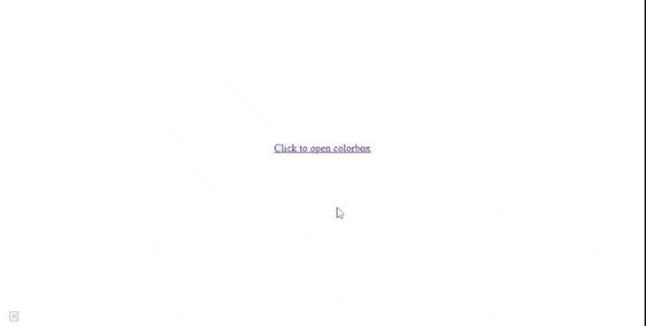

# 如何使用 jQuery 改变颜色框的位置？

> 原文:[https://www . geeksforgeeks . org/如何使用-jquery/](https://www.geeksforgeeks.org/how-to-change-the-position-of-the-colorbox-using-jquery/) 更改颜色框的位置

Colorbox 是一个 jQuery 插件，它扩展了 jQuery 库以包含额外的功能。

**方法:**我们可以使用位置参数来更改 jQuery 中 colorbox 的位置，例如*顶部、左侧、右侧、底部*。

**语法:**

```
$(element).colorbox({ 
    top: "Apx",
    left: "Bpx",
    right: "Cpx",
    bottom: "Dpx"
});
```

**示例 1:** 以下示例演示了没有参数的插件。

## 超文本标记语言

```
<!doctype html>
<html>

<head>
    <script src=
"https://code.jquery.com/jquery-3.6.0.min.js">
    </script>

    <script src=
        "jquery.colorbox-min.js">
    </script>

    <style>
        body {
            text-align: center;
            margin-top: 22%;
        }
    </style>
</head>

<body>
    <a href='geeksimage.png'>
        Click to open colorbox
    </a>

    <script>
        $('a').colorbox();
    </script>
</body>

</html>
```

**输出:**


**示例 2:** 以下示例演示了使用 *left : 0px 将颜色框向左移动。*

## 超文本标记语言

```
<!doctype html>
<html>

<head>
    <script src=
"https://code.jquery.com/jquery-3.6.0.min.js">
    </script>

    <script src=
        "jquery.colorbox-min.js">
    </script>

    <style>
        body {
            text-align: center;
            margin-top: 22%;
        }
    </style>
</head>

<body>
    <a href='geeksimage.png'>
        Click to open colorbox
    </a>

    <script>
        $('a').colorbox({ left: "0px" });
    </script>
</body>

</html>
```

**输出:**



**示例 3:** 以下示例演示了使用*右:0px 向右移动颜色框。*

## 超文本标记语言

```
<!doctype html>
<html>

<head>
    <script src=
"https://code.jquery.com/jquery-3.6.0.min.js">
    </script>

    <script src=
        "jquery.colorbox-min.js">
    </script>

    <style>
        body {
            text-align: center;
            margin-top: 22%;
        }
    </style>
</head>

<body>
    <a href='geeksimage.png'>
        Click to open colorbox
    </a>

    <script>
        $('a').colorbox({ right: "0px" });
    </script>
</body>

</html>
```

**输出:**



我们也可以同时使用 1 个以上的位置参数。

**示例 4:** 以下示例演示了左上角的位置。

## 超文本标记语言

```
<!doctype html>
<html>

<head>
    <script src=
"https://code.jquery.com/jquery-3.6.0.min.js">
    </script>

    <script src=
        "jquery.colorbox-min.js">
    </script>

    <style>
        body {
            text-align: center;
            margin-top: 22%;
        }
    </style>
</head>

<body>
    <a href='geeksimage.png'>
        Click to open colorbox
    </a>

    <script>
        $('a').colorbox({ 
            top: "0px", 
            left: "0px" 
        });
    </script>
</body>

</html>
```

**输出:**

