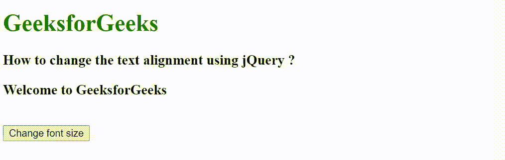

# 如何使用 jQuery 更改文本对齐方式？

> 原文:[https://www . geesforgeks . org/如何使用-jquery/](https://www.geeksforgeeks.org/how-to-change-the-text-alignment-using-jquery/) 更改文本对齐方式

在本文中，我们将看到如何使用 jQuery 更改元素的文本对齐方式。要更改元素的文本对齐方式，我们使用 css()方法。

**css()方法**用于更改所选元素的样式属性。

**语法:**

```html
$(selector).css(property)
```

在下面的例子中，首先，我们创建了一个包含 id 属性的

### 元素，并且还创建了一个按钮元素。当用户单击按钮时，调用 css()方法，该方法将文本对齐属性值设置为居中。

**示例:**

## 超文本标记语言

```html
<!DOCTYPE html>
<html lang="en">

<head>
    <meta charset="UTF-8">
    <meta http-equiv="X-UA-Compatible" content="IE=edge">
    <meta name="viewport" content=
        "width=device-width, initial-scale=1.0">

    <!-- Including jQuery -->
    <script src="
https://ajax.googleapis.com/ajax/libs/jquery/3.3.1/jquery.min.js">
    </script>
</head>

<body>
    <h1 style="color: green;">
        GeeksforGeeks
    </h1>

    <h3>
        How to change the text 
        alignment using jQuery ?
    </h3>

    <h3 id="content">
        Welcome to GeeksforGeeks
    </h3>
    <br>

    <button>Change font size</button>

    <script>
        $(document).ready(function() {
            $('button').click(function() {
                $("#content").css("textAlign", "center");
            });
        });
    </script>
</body>

</html>
```

**输出:**

