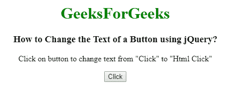

# 如何使用 jQuery 更改按钮的文本？

> 原文:[https://www . geeksforgeeks . org/如何使用-jquery/](https://www.geeksforgeeks.org/how-to-change-the-text-of-a-button-using-jquery/) 更改按钮文本

下面是使用 jQuery 更改按钮文本的问题。要完成这项任务，我们可以使用以下两种方法:

1.  **prop() method:** It is used to set property values, it sets one or more property for the selected elements.

    **语法:**

    ```html
    $(selector).prop(para1, para2)
    ```

    **Approach:**
2.  从<input>元素获取文本。
3.  第一个匹配元素基于 para1。
4.  Change the value set for the selected element from para1 to para2.

    **示例:**

    ```html
    <!DOCTYPE html>
    <html>

    <head>
        <title>
          Change the Text of a Button using jQuery
      </title>
        <script src=
    "https://code.jquery.com/jquery-1.12.4.min.js">
      </script>
    </head>

    <body style="text-align:center;">
        <h1 style="color:green;"> 
            GeeksForGeeks 
        </h1>
        <h3>Change the Text of a Button using jQuery</h3>
        <p>
          Click on button to change text
          from "Click" to "Prop Click"
      </p>
        <input type="button" id="Geeks" value="Click">
        <script>
            $(document).ready(function() {
                $("input").click(function() {
                    // Change text of input button
                    $("#Geeks").prop("value", "Prop Click");
                });
            });
        </script>
    </body>

    </html>
    ```

    **输出:**
    **点击按钮前:**
    
    **点击按钮后:**
    

5.  **The html() method:** It set or return the content (innerHTML) of the selected elements.

    **语法:**

    ```html
    $(selector).html(content)
    ```

    **Approach:**
6.  从<button>元素获取文本。</button>
7.  它匹配选择器元素。
8.  Change the value set for the selected element to content.

    **示例:**

    ```html
    <!DOCTYPE html>
    <html>

    <head>
        <title>How to Change the Text of a 
          Button using jQuery?</title>
        <script src=
                "https://code.jquery.com/jquery-1.12.4.min.js">
      </script>
    </head>

    <body style="text-align:center;">
        <h1 style="color:green;"> 
            GeeksForGeeks 
        </h1>
        <h3>How to Change the Text of a Button using jQuery?</h3>
        <p>Click on button to change text 
          from "Click" to "Html Click"</p>
        <button type="button" id="Geeks">Click</button>
        <script>
            $(document).ready(function() {
                $("button").click(function() {
                    // Change text of button element
                    $("#Geeks").html("Html Click");
                });
            });
        </script>
    </body>

    </html>
    ```

    **输出:**
    **点击按钮前:**
    
    **点击按钮后:**
    