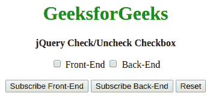
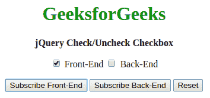

# 如何用 jQuery 勾选复选框？

> 原文:[https://www . geeksforgeeks . org/如何用 jquery 检查复选框/](https://www.geeksforgeeks.org/how-to-check-a-checkbox-with-jquery/)

有两种方法可以通过更改输入类型的选中属性来动态选中当前选中的复选框。

**方法 1:使用[道具方法](https://www.geeksforgeeks.org/jquery-prop-with-examples/) :** 使用道具方法可以访问输入并设置其属性。此方法操作“checked”属性，并根据我们是要选中还是取消选中它，将其设置为 true 或 false。
**语法:**

```
$("element").prop("checked", true)
```

**示例:**

```
<!DOCTYPE html>

<head>
    <title>
        How to check a checkbox with jQuery?
    </title>

    <script src=
"https://code.jquery.com/jquery-2.2.4.min.js">
    </script>
</head>

<body>
    <center>
        <h1 style="color: green"> 
          GeeksforGeeks 
        </h1>

        <b> 
          jQuery Check/Uncheck Checkbox
        </b>

        <p>
            <input type="checkbox" name="option" id="front"> 
            Front-End

            <input type="checkbox" name="option" id="back">
            Back-End
        </p>

        <p>
            <button type="button" class="check-front">
                Subscribe Front-End
            </button>

            <button type="button" class="check-back">
                Subscribe Back-End
            </button>

            <button type="button" class="reset">
                Reset 
            </button>
        </p>

        <script type="text/javascript">
            $(document).ready(function() {
                $(".check-front").click(function() {
                    $("#front").prop("checked", true);
                });
                $(".check-back").click(function() {
                    $("#back").prop("checked", true);
                });
                $(".reset").click(function() {
                    $("#front").prop("checked", false);
                    $("#back").prop("checked", false);
                });

            });
        </script>
    </center>
</body>

</html>
```

**输出:**

*   点击任意按钮前:
    
*   点击按钮:
    
*   点击【重置】按钮:
    

**方法二:使用 [attr 方法](https://www.geeksforgeeks.org/jquery-attr-method/) :** 与上述方法类似，更适合较旧的 jQuery 版本。可以使用 attr 方法访问输入并设置其属性。我们必须操纵' checked '属性，并根据我们想要选中还是取消选中它，将其设置为 true 或 false。
**注意:**设置属性为‘真’时需要增加点击方式，确保选项组中的选项得到更新。
**语法:**

```
$("element").attr("checked", true)
```

**示例:**

```
<!DOCTYPE html>

<head>
    <title>
        How to check a checkbox with jQuery?
    </title>

    <script src=
"https://code.jquery.com/jquery-2.2.4.min.js">
    </script>
</head>

<body>
    <center>
        <h1 style="color: green"> 
        GeeksforGeeks 
    </h1>

        <b> 
        jQuery Check/Uncheck Checkbox
    </b>

        <p>
            <input type="checkbox" name="option" id="Front"> 
            Front-End

            <input type="checkbox" name="option" id="Back"> 
            Back-End
        </p>

        <p>
            <button type="button" class="check-Front">
                Subscribe Front-End
            </button>

            <button type="button" class="check-Back">
                Subscribe Back-End
            </button>

            <button type="button" class="reset">
                Reset 
            </button>
        </p>
        <script type="text/javascript">
            $(document).ready(function() {
                $(".check-Front").click(function() {
                    $("#Front").attr("checked", true);

                });
                $(".check-Back").click(function() {
                    $("#Back").attr("checked", true);
                });
                $(".reset").click(function() {
                    $("#Front").attr("checked", false);
                    $("#Back").attr("checked", false);
                });
            });
        </script>
    </center>
</body>

</html>
```

**输出:**

*   点击任意按钮前:
    
*   点击按钮:
    
*   点击【重置】按钮:
    

jQuery 是一个开源的 JavaScript 库，它简化了 HTML/CSS 文档之间的交互，它以其“少写多做”的理念而闻名。
跟随本 [jQuery 教程](https://www.geeksforgeeks.org/jquery-tutorials/)和 [jQuery 示例](https://www.geeksforgeeks.org/jquery-examples/)可以从头开始学习 jQuery。