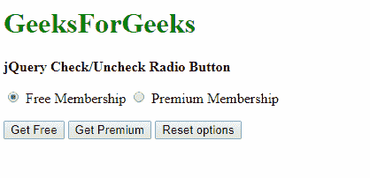
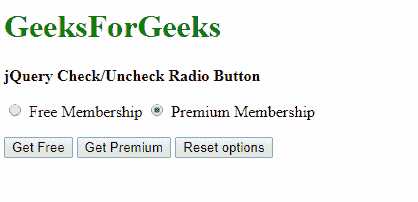
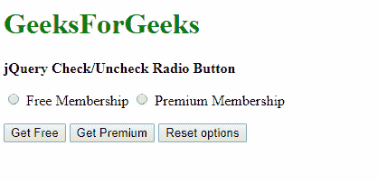

# 如何用 jQuery 检查单选按钮？

> 原文:[https://www . geesforgeks . org/how-check-a-radio-button-with-jquery/](https://www.geeksforgeeks.org/how-to-check-a-radio-button-with-jquery/)

有两种方法可以通过更改输入类型的选中属性来动态更改当前选定的单选按钮。

**方法 1:使用[道具方法](https://www.geeksforgeeks.org/jquery-prop-with-examples/) :** 使用道具方法可以访问输入并设置其属性。此方法操作“checked”属性，并根据我们是要选中还是取消选中它，将其设置为 true 或 false。

**语法:**

```
$("element").prop("checked", true)
```

**示例:**

```
<!DOCTYPE html>
<head>
    <title>
        How to check a radio button
        with jQuery?
    </title>

    <script src=
        "https://code.jquery.com/jquery-2.2.4.min.js">
    </script>
</head>

<body>
    <h1 style="color: green">
        GeeksForGeeks
    </h1>

    <b>
        jQuery Check/Uncheck Radio Button
    </b>

    <p>
        <input type="radio" name="option" id="free">
            Free Membership

        <input type="radio" name="option" id="premium">
            Premium Membership
    </p>

    <p>
        <button type="button" class="check-free">
            Get Free
        </button>

        <button type="button" class="check-premium">
            Get Premium
        </button>

        <button type="button" class="reset">
            Reset options
        </button>
    </p>

    <script type="text/javascript">
        $(document).ready(function () {
            $(".check-free").click(function () {
                $("#free").prop("checked", true);
            });
            $(".check-premium").click(function () {
                $("#premium").prop("checked", true);
            });
            $(".reset").click(function () {
                $("#free").prop("checked", false);
                $("#premium").prop("checked", false);
            });
        });
    </script>
</body>

</html>                    
```

**输出:**

*   **点击【获取免费】按钮:**
    
*   **点击【获取奖励】按钮:**
    
*   **点击【重置选项】按钮:**
    

**方法二:使用 [attr 方法](https://www.geeksforgeeks.org/jquery-attr-method/) :** 与上述方法类似，更适合较老的 jQuery 版本。可以使用 attr 方法访问输入并设置其属性。我们必须操纵' checked '属性，并根据我们想要选中还是取消选中它，将其设置为 true 或 false。

**注意:**将属性设置为‘true’时需要增加一个 click 方法，确保选项组中的选项得到更新。

**语法:**

```
$("element").attr("checked", true)
```

**示例:**

```
<!DOCTYPE html>
<head>
    <title>
        How to check a radio
        button with jQuery?
    </title>

    <script src=
        "https://code.jquery.com/jquery-2.2.4.min.js">
    </script>
</head>

<body>
    <h1 style="color: green">
        GeeksForGeeks
    </h1>
    <b>jQuery Check/Uncheck Radio Button</b>
    <p>
        <input type="radio" name="option" id="free">
            Free Membership
        <input type="radio" name="option" id="premium">
            Premium Membership
    </p>

    <p>
        <button type="button" class="check-free">
            Get Free
        </button>

        <button type="button" class="check-premium">
            Get Premium
        </button>

        <button type="button" class="reset">
            Reset options
        </button>
    </p>

    <script type="text/javascript">
        $(document).ready(function () {
            $(".check-free").click(function () {
                $("#free").attr("checked", true).click();
            });
            $(".check-premium").click(function () {
                $("#premium").attr("checked", true).click();
            });
            $(".reset").click(function () {
                $("#free").attr("checked", false);
                $("#premium").attr("checked", false);
            });
        });
    </script>
</body>

</html>                    
```

**输出:**

*   **点击【获取免费】按钮:**
    
*   **点击【获取奖励】按钮:**
    
*   **点击【重置选项】按钮:**
    

jQuery 是一个开源的 JavaScript 库，它简化了 HTML/CSS 文档之间的交互，它以其“少写多做”的理念而闻名。
跟随本 [jQuery 教程](https://www.geeksforgeeks.org/jquery-tutorials/)和 [jQuery 示例](https://www.geeksforgeeks.org/jquery-examples/)可以从头开始学习 jQuery。