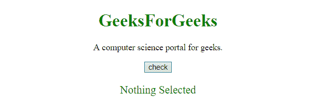

# 如何使用 jQuery 检查选择器是否匹配某些内容？

> 原文:[https://www . geesforgeks . org/how-check-a-selector-matches-some-content-use-jquery/](https://www.geeksforgeeks.org/how-to-check-a-selector-matches-some-content-using-jquery/)

为了知道 jQuery 选择器是否选择了任何元素，这里讨论 2 个方法，这些是最常用的方法。

**示例-1:** 在本例中，选择器搜索 **< p >** 元素。本示例使用**长度**属性来检查是否选择了某些内容。在这种情况下 **< p >** 元素被找到。

```
<!DOCTYPE html>
<html>

<head>
    <title>
        JQuery | 
      check if a selector matches something.
    </title>
    <script src=
"https://ajax.googleapis.com/ajax/libs/jquery/3.4.0/jquery.min.js">
  </script>
</head>

<body style="text-align:center;" id="body">
    <h1 style="color:green;">  
            GeeksForGeeks  
        </h1>
    <p>
        A computer science portal for geeks.
    </p>
    <button onclick="gfg_Run()">
        check
    </button>
    <p id="GFG_DOWN" 
       style="color:green; 
              font-size: 20px;">
    </p>
    <script>
        var el_down = 
            document.getElementById("GFG_DOWN");
        var str = '';

        function gfg_Run() {
            if ($("p").length) {
                str = "Something Selected";
            } else {
                str = "Nothing Selected";
            }
            el_down.innerHTML = str;
        }
    </script>
</body>

</html>
```

**输出:**

*   **点击按钮前:**
    
*   **点击按钮后:**
    

**示例-2:** 在本例中，选择器搜索 **<一个>** 元素。该示例还使用**长度**属性来检查是否选择了某些内容。在这种情况下 **<一个>** 元素没有找到。

```
<!DOCTYPE html>
<html>

<head>
    <title>
        JQuery | 
      check if a selector matches something.
    </title>
    <script src=
"https://ajax.googleapis.com/ajax/libs/jquery/3.4.0/jquery.min.js">
  </script>
</head>

<body style="text-align:center;" id="body">
    <h1 style="color:green;">  
            GeeksForGeeks  
        </h1>
    <p>
        A computer science portal for geeks.
    </p>
    <button onclick="gfg_Run()">
        check
    </button>
    <p id="GFG_DOWN" 
       style="color:green;
              font-size: 20px;">
    </p>
    <script>
        var el_down = 
            document.getElementById("GFG_DOWN");
        var str = '';

        function gfg_Run() {
            if ($("a").length) {
                str = "Something Selected";
            } else {
                str = "Nothing Selected";
            }
            el_down.innerHTML = str;
        }
    </script>
</body>

</html>
```

**输出:**

*   **点击按钮前:**
    
*   **点击按钮后:**
    

**示例-3:** 在本例中，选择器搜索 **<按钮>** 元素。本示例使用**存在**功能来检查是否选择了某些东西。在这种情况下 **<按钮>** 元素被找到。

```
<!DOCTYPE html>
<html>

<head>
    <title>
        JQuery | 
      check if a selector matches something.
    </title>
    <script src=
"https://ajax.googleapis.com/ajax/libs/jquery/3.4.0/jquery.min.js">
  </script>
</head>

<body style="text-align:center;" id="body">
    <h1 style="color:green;">  
            GeeksForGeeks  
        </h1>
    <p>
        A computer science portal for geeks.
    </p>
    <button onclick="gfg_Run()">
        check
    </button>
    <p id="GFG_DOWN" 
       style="color:green; 
              font-size: 20px;">
    </p>
    <script>
        var el_down = 
            document.getElementById("GFG_DOWN");
        var str = '';
        jQuery.fn.exists = function() {
            return this.length > 0;
        }

        function gfg_Run() {
            if ($("button").exists()) {
                str = "Something Selected";
            } else {
                str = "Nothing Selected";
            }
            el_down.innerHTML = str;
        }
    </script>
</body>

</html>
```

**输出:**

*   **点击按钮前:**
    
*   **点击按钮后:**
    