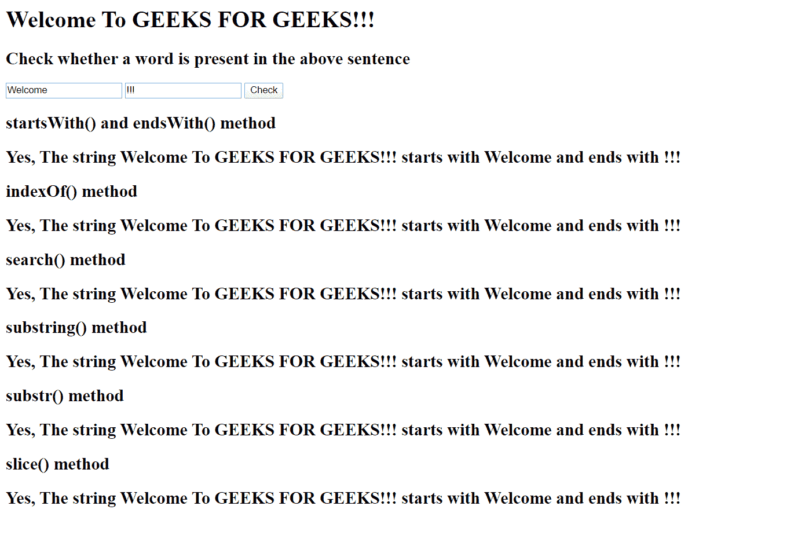
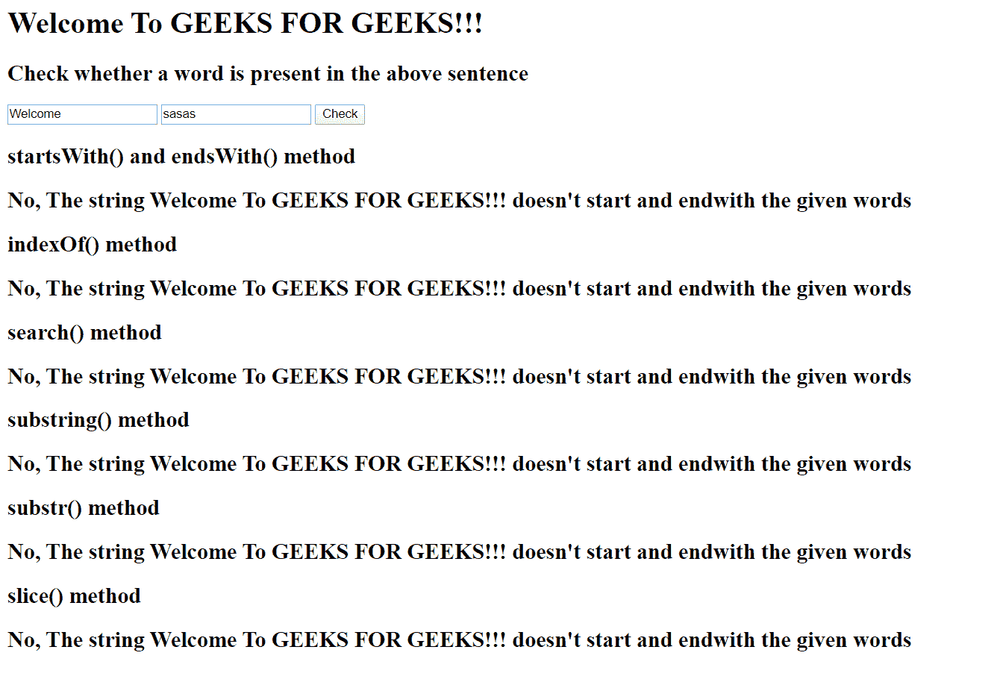

# 如何在 jQuery 中检查以特定字符串开头/结尾的字符串？

> 原文:[https://www . geesforgeks . org/如何检查字符串-以特定字符串开头-结尾-在 jquery 中/](https://www.geeksforgeeks.org/how-to-check-a-string-starts-ends-with-a-specific-string-in-jquery/)

JavaScript 提供了很多字符串方法来检查一个字符串是否是其他字符串的子字符串。因此，执行这个任务根本不需要 jQuery。但是，我们将介绍检查字符串是以字符串开头还是结尾的所有不同方法:

*   [开始开关()](https://www.geeksforgeeks.org/javascript-string-startswith/)和[结束开关()](https://www.geeksforgeeks.org/javascript-string-endswith/)方法
*   [搜索()方法](https://www.geeksforgeeks.org/javascript-string-search/)
*   [indexOf()方法](https://www.geeksforgeeks.org/javascript-string-prototype-indexof-function/)
*   [子串()方法](https://www.geeksforgeeks.org/javascript-string-substring/)
*   [substr()方法](https://www.geeksforgeeks.org/javascript-string-substr/)
*   [切片()法](https://www.geeksforgeeks.org/javascript-string-slice/)

让我们考虑一个字符串 str = "欢迎来到极客为极客！！!"。现在我们必须找到字符串字符串是否以 startword =“欢迎”开头，以 endword =“结束！！!"。

**方法:**
[**starts with()**](https://www.geeksforgeeks.org/javascript-string-startswith/)**和**[**ends with()**](https://www.geeksforgeeks.org/javascript-string-endswith/)**方法:**它检查字符串是以特定的子字符串开始还是结束。

**示例:**

## java 描述语言

```html
if (str.startsWith(startword) && str.endsWith(endword)) {

    // case sensitive
    console.log("Yes, The string " + str + " starts with "
            + startword + " and ends with " + endword);
}
```

[**search()方法:**](https://www.geeksforgeeks.org/javascript-string-search/) 它检查一个特定的字符串是否包含在另一个字符串中，并返回该子字符串的起始索引。

**示例:**

## java 描述语言

```html
if (str.search(startword)==0 &&
    str.search(endword)==stringlength-endwordlength ) {

    // case sensitive
    console.log("Yes, The string " + str + " starts with "
            + startword + " and ends with " + endword);
}
```

[**indexOf()方法:**](https://www.geeksforgeeks.org/javascript-string-prototype-indexof-function/) 顾名思义，它在字符串中找到一个子串的起始索引。

**示例:**

## java 描述语言

```html
if (str.indexOf(startword)==0 &&
    str.indexOf(endword)==stringlength-endwordlength) {

    console.log("Yes, The string " + str + " starts with "
            + startword + " and ends with " + endword);
}
```

[**【substring()】方法:**](https://www.geeksforgeeks.org/javascript-string-substring/) 它返回一个出现在起始索引和结束索引之间的字符串。

**示例:**

## java 描述语言

```html
if(str.substring(0, startwordlength)==startword
        && str.substring(stringlength-endwordlength,
        stringlength)==endword) {

    console.log("Yes, The string " + str + " starts with "
            + startword + " and ends with " + endword);
}
```

[**substr()方法:**](https://www.geeksforgeeks.org/javascript-string-substr/) 类似 substring()方法，但以子串的起始索引和长度为参数。

**示例:**

## java 描述语言

```html
if(str.substr(0, startwordlength)==startword
        && str.substr(stringlength-endwordlength,
        endwordlength)==endword) {

    console.log("Yes, The string " + str + " starts with "
            + startword + " and ends with " + endword);
}
```

[**slice()方法:**](https://www.geeksforgeeks.org/javascript-string-slice/) 该方法返回字符串中任意两个索引之间的字符串切片。

**示例:**

## java 描述语言

```html
if(str.slice(0, startwordlength)==startword
        && str.slice(stringlength-endwordlength,
        stringlength)==endword) {

    console.log("Yes, The string " + str + " starts with "
            + startword + " and ends with " + endword);
}
```

**我们以 h1 元素中的文本为例，检查它是否以给定的子串开始和结束。**

## java 描述语言

```html
<!DOCTYPE html>
<html>

<head>
    <title>
        How to know that a string starts/ends
        with a specific string in jQuery?
    </title>

    <script src="https://ajax.googleapis.com/ajax/libs/jquery/3.4.1/jquery.min.js">
    </script>
</head>

<body>
    <h1 id="text">
        Welcome To GEEKS FOR GEEKS!!!
    </h1>

    <h2>
        Check whether a word is present
        in the above sentence
    </h2>

    <input type="text" id="startkey">
    <input type="text" id="endkey">
    <button onclick="MyFunction()"> Check </button>

    <h2> startsWith() and endsWith() method </h2>
    <h2 id="startswith"> </h2>

    <h2> indexOf() method </h2>
    <h2 id="indexOf"></h2>

    <h2> search() method </h2>
    <h2 id="search"></h2>

    <h2> substring() method </h2>
    <h2 id="substring"></h2>

    <h2> substr() method </h2>
    <h2 id="substr"> </h2>

    <h2> slice() method </h2>
    <h2 id="slice"></h2>

    <script>
        var str = document.getElementById("text").innerText;
        stringlength = str.length;
        var startword = "";
        var endword = "";
        function MyFunction() {
            startword = document.getElementById("startkey").value;
            endword = document.getElementById("endkey").value;
            console.log(startword);
            console.log(endword)
            startwordlength = startword.length;
            endwordlength = endword.length;

            if (str.startsWith(startword) && str.endsWith(endword)) {
                // case sensitive
                var h2 = document.getElementById("startswith");
                h2.innerHTML =
                    "Yes, The string " + str + " starts with "
                    + startword + " and ends with " + endword;
            }
            else {
                var h2 = document.getElementById("startswith");
                h2.innerHTML =
                    "No, The string " + str +
                    " doesn't start and endwith the given words";
            }
            //Js
            if (str.indexOf(startword) == 0 && str.indexOf(
                endword) == stringlength - endwordlength) {
                var h2 = document.getElementById("indexOf");
                h2.innerHTML =
                    "Yes, The string " + str + " starts with "
                    + startword + " and ends with " + endword;
            }
            else {
                var h2 = document.getElementById("indexOf");
                h2.innerHTML =
                    "No, The string " + str +
                    " doesn't start and endwith the given words";
            }
            //Js
            if (str.search(
                startword) == 0 && str.search(endword)
                    == stringlength - endwordlength) {

                // case sensitive
                var h2 = document.getElementById("search");
                h2.innerHTML = "Yes, The string " + str +
                        " starts with " + startword +
                        " and ends with " + endword;
            }
            else {
                var h2 = document.getElementById("search");
                h2.innerHTML = "No, The string " + str +
                    " doesn't start and endwith the given words";
            }
            //Js
            if (str.substring(
                0, startwordlength) == startword && str.substring(
                    stringlength - endwordlength, stringlength) == endword) {
                var h2 = document.getElementById("substring");
                h2.innerHTML =
                    "Yes, The string " + str + " starts with "
                    + startword + " and ends with " + endword;
            }
            else {
                var h2 = document.getElementById("substring");
                h2.innerHTML =
                    "No, The string " + str +
                    " doesn't start and endwith the given words";
            }

            if (str.substr(
                0, startwordlength) == startword && str.substr(
                    stringlength - endwordlength, endwordlength) == endword) {
                var h2 = document.getElementById("substr");
                h2.innerHTML =
                    "Yes, The string " + str + " starts with "
                    + startword + " and ends with " + endword;
            }
            else {
                var h2 = document.getElementById("substr");
                h2.innerHTML =
                    "No, The string " + str +
                    " doesn't start and endwith the given words";
            }
            if (str.slice(
                0, startwordlength) == startword && str.slice(
                    stringlength - endwordlength, stringlength) == endword) {
                var h2 = document.getElementById("slice");
                h2.innerHTML =
                    "Yes, The string " + str + " starts with " +
                    startword + " and ends with " + endword;
            }
            else {
                var h2 = document.getElementById("slice");
                h2.innerHTML =
                    "No, The string " + str +
                    " doesn't start and endwith the given words";
            }
        }
    </script>
</body>

</html>
```

**输出:**


