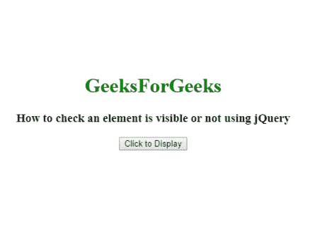
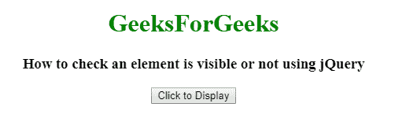
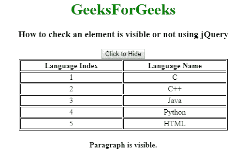
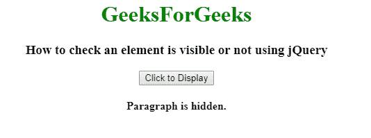

# 如何使用 jQuery 检查一个元素是否可见？

> 原文:[https://www . geeksforgeeks . org/如何使用 jquery 检查元素是否可见/](https://www.geeksforgeeks.org/how-to-check-an-element-is-visible-or-not-using-jquery/)

给定一个 HTML 文档，任务是使用 jQuery **:可见**选择器检查元素是**可见**还是**不可见**。:可视选择器可与**一起使用。toggle()** 功能切换元素的可见性。它将与元素可见性一起工作:隐藏；或不透明度:0；

**语法:**

```html
$(element).is(":visible");
```

**示例 1:** 本示例使用:可见选择器使用 jQuery 检查元素是否可见。

```html
<!DOCTYPE html>
<html>

<head>
    <title>
        How to check an element is
        visible or not using jQuery?
    </title>

    <script src=
"https://code.jquery.com/jquery-1.12.4.min.js">
    </script>
</head>

<body style="text-align:center;">

    <h1 style = "color:green;" > 
        GeeksForGeeks 
    </h1> 

    <h3>
        How to check an element is 
        visible or not using jQuery ?
    </h3>

    <p style="display: none;">
        GEEKSFORGEEKS - A computer science
        portal for geeks.
    </p>

    <input onclick="change()" type="button"
        value="Click to Display" id="myButton1">
    </input>

    <script type="text/javascript">
        $(document).ready(function() {
            $("input").click(function() {

                // Display hide paragraph on button click
                if (this.value == "Click to Display") 
                    this.value = "Click to Hide";
                else this.value = "Click to Display";

                $("p").toggle("slow", function() {

                    // Check paragraph once toggle
                    // effect is completed
                    if($("p").is(":visible")) {
                        alert("Paragraph is visible.");
                    } else {
                        alert("Paragraph is hidden.");
                    }
                });
            });
        });
    </script>
</body>

</html>        
```

**输出:**


**示例 2:** 本示例使用:可见选择器使用 jQuery 检查元素是否可见。

```html
<!DOCTYPE html>
<html>

<head>
    <title>
        How to check an element is
        visible or not using jQuery?
    </title>

    <script src=
"https://code.jquery.com/jquery-1.12.4.min.js">
    </script>

    <style> 
        h1 { 
            color: green; 
        } 
        table, th, td { 
            border: 1px solid black; 
            text-align: center;
        } 
    </style>
</head>

<body>
    <center>
    <h1 style = "color:green;" > 
        GeeksForGeeks 
    </h1> 

    <h3>
        How to check an element is 
        visible or not using jQuery?
    </h3>

    <input onclick="change()" type="button"
        value="Click to Display" id="myButton1">
    </input>

    <table style="width:70% "> 

        <tr> 
            <th>Language Index</th> 
            <th>Language Name</th> 
        </tr> 
        <tr> 
            <td>1</td> 
            <td>C</td> 
        </tr> 
        <tr> 
            <td>2</td> 
            <td>C++</td> 
        </tr> 
        <tr> 
            <td>3</td> 
            <td>Java</td> 
        </tr> 
        <tr> 
            <td>4</td> 
            <td>Python</td> 
        </tr> 
        <tr> 
            <td>5</td> 
            <td>HTML</td> 
        </tr> 
    </table> 

    <h4></h4>

    <script type="text/javascript">
        $(document).ready(function() {
            $("input").click(function() {

                // Display hide paragraph on
                // button click
                if (this.value=="Click to Display")
                    this.value = "Click to Hide";
                else 
                    this.value = "Click to Display";

                $("table").toggle("slow", function() {

                    // Check paragraph once toggle
                    // effect is completed
                    if($("table").is(":visible")) {
                        $("h4").text("Paragraph is visible.");
                    } 
                    else {
                        $("h4").text("Paragraph is hidden.");
                    }
                });
            });
        });
    </script>
    <center>
</body>

</html>        
```

**输出:**

*   **之前点击按钮:**
    
*   **点击后点击【点击显示】按钮:**
    
*   **点击【点击隐藏】按钮后:**
    