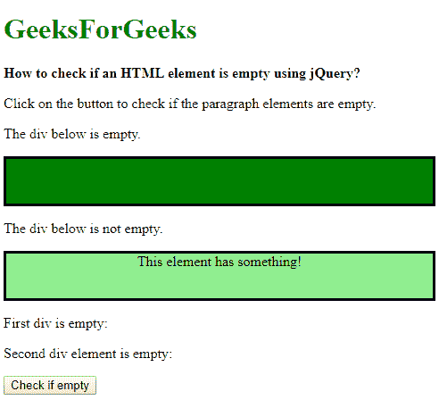
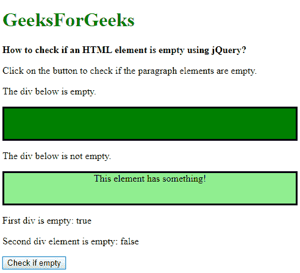

# 如何使用 jQuery 检查一个 HTML 元素是否为空？

> 原文:[https://www . geeksforgeeks . org/如何使用-jquery/](https://www.geeksforgeeks.org/how-to-check-an-html-element-is-empty-using-jquery/) 检查一个 html 元素是否为空

给定一个 HTML 文档，从该文档中选择一个元素，并检查该元素是否为空。有两种方法可以解决这个问题，下面将进行讨论:

**方法 1:使用“:空”选择器:**要使用()方法检查的元素。is()方法用于检查所选元素之一是否与选择器元素匹配。此方法可用于此元素，通过使用“空”选择器来测试它是否为空。“空”选择器用于选择所有没有子元素的元素。如果元素为空，它将返回 true，否则返回 false。

**语法:**

```html
$('#elementSelector').is(':empty')
```

**示例:**

```html
<!DOCTYPE html>
<html>

<head>
    <title>
        How to check an HTML element
        is empty using jQuery ?
    </title>

    <script src=
        "https://code.jquery.com/jquery-3.3.1.min.js">
    </script>

    <style>
        #empty {
            background-color: green;
            height: 50px;
            border: solid;
        } 

        #not-empty {
            background-color: lightgreen;
            height: 50px;
            border: solid;
            text-align: center;
        } 
    </style>
</head>

<body>
    <h1 style="color: green">
        GeeksForGeeks
    </h1>

    <b>
        How to check if an HTML element
        is empty using jQuery?
    </b>

    <p>
        Click on the button to check if
        the paragraph elements are empty.
    </p>

    <p>The div below is empty.</p>
    <div id="empty"></div>

    <p>The div below is not empty.</p>
    <div id="not-empty">This element has something!</div>

    <p>
        First div is empty: 
        <span class="output1"></span>
    </p>

    <p>
        Second div element is empty: 
        <span class="output2"></span>
    </p>

    <button onclick="checkifEmpty()">
        Check if empty
    </button>

    <script>
        function checkifEmpty() {
            if ($('#empty').is(':empty')) {
                document.querySelector('.output1').textContent = true;
            }
            else {
                document.querySelector('.output1').textContent = false;
            }

            if ($('#not-empty').is(':empty')) {
                document.querySelector('.output2').textContent = true;
            }
            else {
                document.querySelector('.output2').textContent = false;
            }

        };
    </script>
</body>

</html>                    
```

**输出:**

*   **点击按钮前:**
    
*   **点击按钮后:**
    

**方法 2:使用 length 属性:**length 属性用于此元素以确定其长度。它在一个 jQuery 元素中找到对象的数量。长度为 0 意味着元素中没有其他元素。除 0 之外的任何值都意味着存在某个元素。这可用于检查元素是否为空。

**语法:**

```html
$('#elementSelector').length
```

**示例:**

```html
<!DOCTYPE html>
<html>

<head>
    <title>
        How to check if an HTML element
        is empty using jQuery?
    </title>

    <script src=
        "https://code.jquery.com/jquery-3.3.1.min.js">
    </script>

    <style>
        #empty {
            background-color: green;
            height: 50px;
            border: solid;
        } 

        #not-empty {
            background-color: lightgreen;
            height: 50px;
            border: solid;
            text-align: center;
        } 
    </style>
</head>

<body>
    <h1 style="color: green">
        GeeksForGeeks
    </h1>

    <b>
        How to check if an HTML element
        is empty using jQuery?
    </b>

    <p>
        Click on the button to check if 
        the paragraph elements are empty.
    </p>

    <p>The div below is empty.</p>
    <div id="empty"></div>

    <p>The div below is not empty.</p>
    <div id="not-empty">
        This element has something!
    </div>

    <p>
        First div is empty: 
        <span class="output1"></span>
    </p>
    <p>
        Second div element is empty: 
        <span class="output2"></span>
    </p>

    <button onclick="checkifEmpty()">
        Check if empty
    </button>

    <script>
        function checkifEmpty() {
            if ($('#empty').length) {
                document.querySelector('.output1').textContent = true;
            }
            else {
                document.querySelector('.output1').textContent = false;
            }

            if ($('#non-empty').length) {
                document.querySelector('.output2').textContent = true;
            }
            else {
                document.querySelector('.output2').textContent = false;
            }
        };
    </script>
</body>

</html>                    
```

**输出:**

*   **点击按钮前:**
    
*   **点击按钮后:**
    

jQuery 是一个开源的 JavaScript 库，它简化了 HTML/CSS 文档之间的交互，它以其“少写多做”的理念而闻名。
跟随本 [jQuery 教程](https://www.geeksforgeeks.org/jquery-tutorials/)和 [jQuery 示例](https://www.geeksforgeeks.org/jquery-examples/)可以从头开始学习 jQuery。