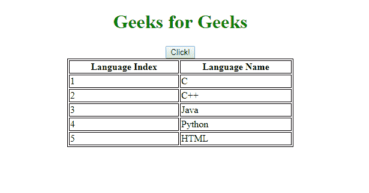
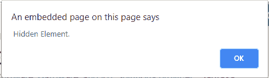

# 如何检查 jQuery 中是否隐藏了一个元素？

> 原文:[https://www . geeksforgeeks . org/如何检查一个元素是否隐藏在 jquery 中/](https://www.geeksforgeeks.org/how-to-check-if-an-element-is-hidden-in-jquery/)

要检查一个元素是**隐藏的**还是**不是**，可以使用 jQuery **:隐藏的**选择器。**。toggle()** 功能用于切换元素的可见性。

**语法:**

```
$(element).is(":hidden");
```

**示例:**

```
<!DOCTYPE html>
<html lang="en">

<head>
    <meta charset="utf-8">
    <title>
        Jquery Hidden element Checking
    </title>
    <style>
        h1 {
            color: green;
        }

        table,
        th,
        td {
            border: 1px solid black;
        }
    </style>
    <script src=
"https://code.jquery.com/jquery-1.12.4.min.js">
    </script>

    <script type="text/javascript">
        $(document).ready(function() {
            $("button").click(function() {
                $("table").toggle("slow", function() {
                    if ($("table").is(":hidden")) {

                        alert(" Hidden Element.");
                    } else {
                        alert("Element Visible.");
                    }
                });
            });
        });
    </script>
</head>

<body>
    <center>
        <h1>Geeks for Geeks</h1>
        <button type="button">
            Click!
        </button>
        <table style="width:60%">
            <tr>
                <th>Language Index</th>
                <th>Language Name</th>
            </tr>
            <tr>
                <td>1</td>
                <td>C</td>
            </tr>
            <tr>
                <td>2</td>
                <td>C++</td>
            </tr>
            <tr>
                <td>3</td>
                <td>Java</td>
            </tr>
            <tr>
                <td>4</td>
                <td>Python</td>
            </tr>
            <tr>
                <td>5</td>
                <td>HTML</td>
            </tr>
        </table>
    </center>
</body>

</html>
```

**输出:**
**点击前:**


**点击后:**


