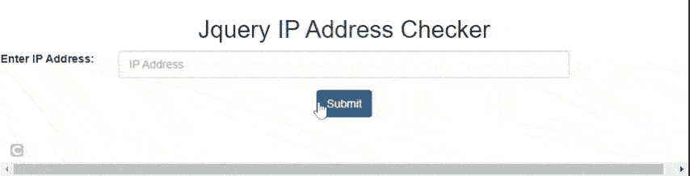

# 如何在 jQuery 中检查 IP 地址的有效性？

> 原文:[https://www . geeksforgeeks . org/如何在 jquery 中检查验证 ip 地址/](https://www.geeksforgeeks.org/how-to-check-validation-of-ip-address-in-jquery/)

在本文中，我们将找到如何使用 jQuery 验证 **IP 地址**。

**IP 地址:**每台连接到互联网的计算机都可以通过一个唯一的字符串来识别，该字符串被称为其互联网协议(IP)地址。它由四个数字组成(每个数字介于 0 和 255 之间)，用点隔开。一个 IP 地址的格式可以写成四个用点分隔的十进制数字，每个数字可以写成 0 到 255。有效 IP 地址的一个例子如下。

*   255.255.11.135
*   110.234.52.124

我们可以很容易地使用正则表达式来检查 IP 地址是否有效。让我们举个例子来理解它是如何工作的。现在让我们首先讨论如何使用正则表达式来验证 IP 地址。用于验证 IP 地址尤其是 ip4 地址的正则表达式如下。

> ^(([0-9]|[1-9][0-9]|1[0-9]{2}|2[0-4][0-9]|25[0-5])\.){3}([0-9]|[1-9][0-9]|1[0-9]{2}|2[0-4][0-9]|25[0-5])$

*   在上式中**【0-9】**表示 0 到 9 之间的任意数字。
*   **|** 表示条件“*或*”。
*   **[1-9][0-9]** 表示 10 到 99 之间的任意数字。
*   **1[0-9]{2}** 表示 1[0-9][0-9]，表示从 100 到 199 之间的任何数字。
*   **2[0-4][0-9]** 表示从 200 到 249 之间的任意数字。
*   **25[0-5]** 表示从 250 到 255 之间的任何数字。
*   **{3}** 表示模式出现三次。

**示例:**

## 超文本标记语言

```html
<!DOCTYPE html>
<html lang="en">
  <head>
    <link
      rel="stylesheet"
      href=
"https://maxcdn.bootstrapcdn.com/bootstrap/3.4.1/css/bootstrap.min.css"/>
    <script src=
"https://code.jquery.com/jquery-3.5.0.js">
    </script>
    <script src=
"https://maxcdn.bootstrapcdn.com/bootstrap/3.4.1/js/bootstrap.min.js">
    </script>
  </head>
  <body style="text-align: center">
    <h2>Jquery IP Address Checker</h2>
    <div>
      <div class="form-group row">
        <label for="inputPassword"
               class="col-sm-2 col-form-label">
          Enter IP Address:
        </label>
        <div class="col-sm-8">
          <input
            type="text"
            class="form-control"
            id="ip"
            name="ip"
            placeholder="IP Address"
          />
        </div>
      </div>
      <button type="submit" id="submit" 
              class="btn btn-primary">
        Submit
      </button>
      <p style="color: green" id="demo"></p>

    </div>
    <script>
      $(document).ready(function () {
        $("#submit").click(function (value) {
          // Using Regex expression for validating IPv4
          var ipaddress =
            /^(([0-9]|[1-9][0-9]|1[0-9]{2}|2[0-4][0-9]|25[0-5])\.){3}([0-9]|[1-9][0-9]|1[0-9]{2}|2[0-4][0-9]|25[0-5])$/;
          var content = $("#ip").val();

          if (ipaddress.test(content)) {
            $("#demo").html("Ipaddress is Valid");
          } else {
            $("#demo").html("Ipaddress is invalid");
          }
        });
      });
    </script>
  </body>
</html>
```

**输出:**输入有效和无效的 IP 地址会显示以下结果。



IP 地址验证输出