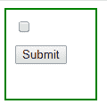
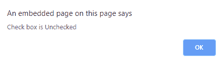
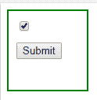
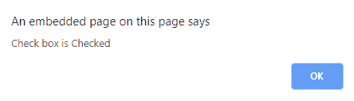

# 如何检查 jQuery 中是否勾选了复选框？

> 原文:[https://www . geeksforgeeks . org/如何检查复选框是否被检入 jquery/](https://www.geeksforgeeks.org/how-to-check-whether-a-checkbox-is-checked-in-jquery/)

[**prop()**](https://www.geeksforgeeks.org/jquery-prop-with-examples/) 和 [**is()**](https://www.geeksforgeeks.org/jquery-is-method/) 方法是我们可以通过*检查一个复选框在 jQuery 中是否被选中的两种方式*。

**prop():** 这个方法提供了一个简单的方法来跟踪复选框的状态。它在任何情况下都能很好地工作，因为每个复选框都有指定其选中或未选中状态的选中属性。

**是():**这个方法也很简单，很好用。通过使用它，我们可以很容易地发现一个复选框是否被选中。

**使用 jQuery prop()方法:**
**语法:**

```
$(selector).prop(parameter) 

```

**参数:**这里的参数是复选框的当前状态。

**示例-1:**

```
<!DOCTYPE html>
<html>

<head>
    <script src=
"https://ajax.googleapis.com/ajax/libs/jquery/3.3.1/jquery.min.js">
  </script>
</head>

<body>
    <div style="width: 80px;
            height: 80px;
            padding: 10px;
            border: 2px solid green;">

        <input type="checkbox" 
               name="radio1"
               checked />
        <script>
            $(document).ready(function() {
                $("#but").click(function() {
                    if ($("input[type=checkbox]").prop(
                      ":checked")) {
                        alert("Check box in Checked");
                    } else {
                        alert("Check box is Unchecked");
                    }
                });
            });
        </script>

        <br>

        <button style="margin-top:10px"
                id="but" 
                type="submit">
          Submit
      </button>
    </div>
</body>

</html>
```

**输出:**
**点击按钮前复选框未勾选:**


**点击按钮后:**


**使用 jQuery is()方法:**
**语法:**

```
$(selector).is(parameter) 

```

**参数:**此参数是复选框的当前状态。

**示例-2:**

```
<!DOCTYPE html>
<html>

<head>
    <style>
        div {
            width: 80px;
            height: 80px;
            padding: 10px;
            border: 2px solid green;
        }

        button {
            margin-top: 10px;
        }
    </style>
    <script src=
"https://ajax.googleapis.com/ajax/libs/jquery/3.3.1/jquery.min.js">
  </script>

</head>

<body>
    <div>
        <input type="checkbox"
               name="radio1" 
               checked />
        <script>
            $(document).ready(function() {
                $("#but").click(function() {
                    if ($("input[type=checkbox]").is(
                      ":checked")) {
                        alert("Check box in Checked");
                    } else {
                        alert("Check box is Unchecked");
                    }
                });
            });
        </script>

        <br>

        <button id="but" 
                type="submit">
          Submit 
      </button>
    </div>
</body>

</html>
```

**输出:**
**点击按钮前复选框被点击:**


**点击按钮后:**


jQuery 是一个开源的 JavaScript 库，它简化了 HTML/CSS 文档之间的交互，它以其“少写多做”的理念而闻名。
跟随本 [jQuery 教程](https://www.geeksforgeeks.org/jquery-tutorials/)和 [jQuery 示例](https://www.geeksforgeeks.org/jquery-examples/)可以从头开始学习 jQuery。