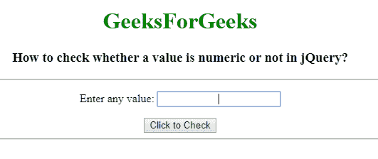
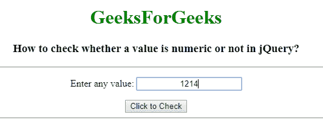
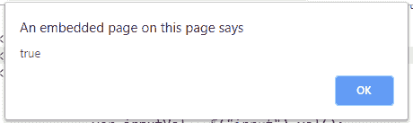
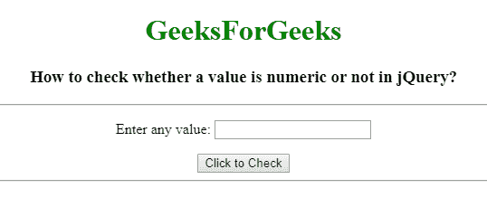
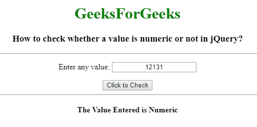

# 如何使用 jQuery 检查一个值是否为数值？

> 原文:[https://www . geeksforgeeks . org/如何使用-jquery/](https://www.geeksforgeeks.org/how-to-check-whether-a-value-is-numeric-or-not-using-jquery/) 检查值是否为数字

给定一个输入元素，任务是使用 jQuery 检查输入的值是否是数字。jQuery **$。isNumeric()方法**用于检查输入的数字是否为数字。

**$。isNumeric()方法:**用于检查给定的参数是否为数值。如果是数字，则返回真，否则返回假。

**语法:**

```
$.isNumeric( argument )
```

**示例 1:** 本示例使用 jQuery。isNumeric()方法检查输入的元素是否为数字。

```
<!DOCTYPE html>
<html>

<head>
    <title>
        How to check whether a value is
        numeric or not in jQuery?
    </title>

    <script src=
"https://code.jquery.com/jquery-1.12.4.min.js">
    </script>
</head>

<body style="text-align:center;">

    <h1 style = "color:green;" > 
        GeeksForGeeks 
    </h1> 

    <h3>
        How to check whether a value
        is numeric or not in jQuery?
    </h3>

    <hr>

    <form>
        <p>
            Enter any value: 
            <input style="text-align:center;" type="text">
        </p>

        <button type="button">Click to Check</button>
    </form>
    <hr>

    <script type="text/javascript">
        $(document).ready(function() {
            $("button").click(function() {
                var inputVal = $("input").val();
                alert($.isNumeric(inputVal));
            });
        });
    </script>
</body>

</html>          
```

**输出:**

*   **输入数值前:**
    
*   **输入数值:**
    
*   **点击按钮后:**
    

**示例 2:** 本示例使用 jQuery。isNumeric()方法检查输入的元素是否为数字。

```
<!DOCTYPE html>
<html>

<head>
    <title>
        How to check whether a value
        is numeric or not in jQuery?
    </title>

    <script src=
"https://code.jquery.com/jquery-1.12.4.min.js">
    </script>
</head>

<body style="text-align:center;">

    <h1 style = "color:green;" > 
        GeeksForGeeks 
    </h1> 

    <h3>
        How to check whether a value 
        is numeric or not in jQuery?
    </h3>
    <hr>

    <form>
        <p>
            Enter any value: 
            <input style="text-align:center;" type="text">
        </p>

        <button type="button">Click to Check</button>
    </form>
    <hr>

    <h4></h4>

    <script type="text/javascript">
        $(document).ready(function() {
            $("button").click(function() {
                var inputVal = $("input").val();
                var gfg = $.isNumeric(inputVal);

                if (gfg) {
                    $("h4").text("The Value Entered is Numeric");
                }
                else {
                    $("h4").text("The Value Entered is Not Numeric");
                }
            });
        });
    </script>
</body>

</html>  
```

**输出:**

*   **输入数值前:**
    
*   **输入数值后点击按钮:**
    