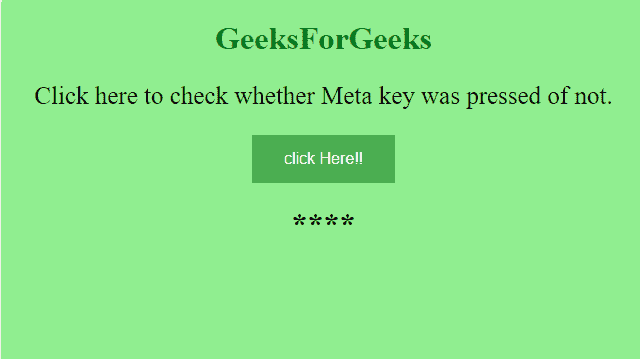
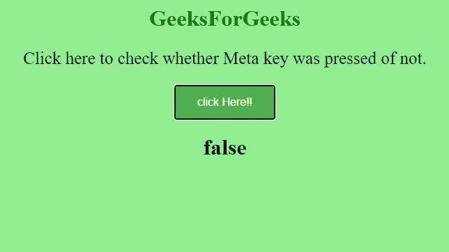

# 如何使用 jQuery 检查事件触发时是否按下了 META 键？

> 原文:[https://www . geeksforgeeks . org/如何使用-jquery/](https://www.geeksforgeeks.org/how-to-check-whether-the-meta-key-pressed-when-event-is-fired-using-jquery/) 检查事件触发时元键是否被按下

jQuery 是一个功能丰富的 JavaScript 库。这是一个快速且最常用的 JavaScript 库。在使用 jQuery 之前，您必须对 HTML、CSS 和 JavaScript 有基本的了解。

在本文中，我们将了解如何在事件触发 JQuery 时检查 META 键是否被按下。

**META 键–**它是一个特殊的键，位于键盘上的空格键旁边。对于不同的操作系统，它位于不同的位置示例–

1.  窗口–元密钥映射到窗口密钥。
2.  Macintosh–元键映射到命令键(⌘).

**event . METAKey–**它将返回一个布尔值(真或假)，指示事件触发时是否按下了 Meta 键。

示例:

## 超文本标记语言

```html
<!doctype html>
<html lang="en">

<head>
    <style>
        h1 {
            color: green;
        }

        body {
            background-color: lightgreen;
            text-align: center;
        }

        div {
            padding: 20px;
        }

        p {
            font-size: 25px;
        }

        button {
            background-color: #4CAF50;
            /* Green */
            border: none;
            color: white;
            padding: 15px 32px;
            text-align: center;
            text-decoration: none;
            display: inline-block;
            font-size: 16px;
        }
    </style>

    <script src=
"https://code.jquery.com/jquery-3.5.0.js">
    </script>
</head>

<body>
    <h1>GeeksForGeeks</h1>

    <p>
        Click here to check whether 
        Meta key was pressed of not.
    </p>

    <button value="Test" name="Test" 
        id="check">
        click Here!!
    </button>

    <h1 style="color:black;" 
        id="display">****
    </h1>

    <script>
        $("#check").click(function(event) {
            $("#display").text(event.metaKey);
        });
    </script>
</body>

</html>
```

**输出:**

**点击按钮前–**只有一个按钮名为‘请点击我！’。



**点击按钮后–**点击按钮后，如果您看到 true，则表明您确实按下了元键，但在这种情况下，您可以注意到您的输出为 false，这表明您没有按下任何元键。

