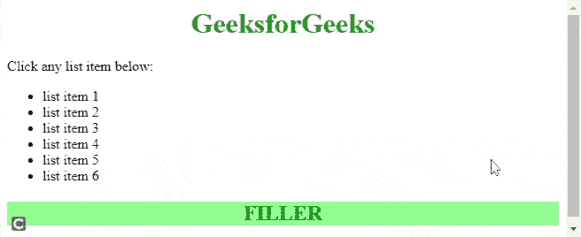

# 如何使用 jQuery 根据表达式检查当前选择？

> 原文:[https://www . geeksforgeeks . org/how-to-checks-current-selection-in-expression-use-jquery/](https://www.geeksforgeeks.org/how-to-checks-the-current-selection-against-an-expression-using-jquery/)

任务是使用 [jQuery](https://www.geeksforgeeks.org/jquery-tutorials/) 根据表达式检查当前选择。jQuery 是一个轻量级且快速的 JavaScript，它简化了 [HTML/CSS](https://www.geeksforgeeks.org/web-technology/html-css/) 文档，或者更准确地说[文档对象模型(DOM)](https://www.geeksforgeeks.org/dom-document-object-model/) 和 [JavaScript](https://www.geeksforgeeks.org/javascript-tutorial/) 之间的交互。

jQuery 以其“少写多做”的座右铭而闻名简单地说，通过写几行代码，你就能达到你的目标。

在 jQuery 中，我们可以使用 [is(选择器)](https://www.geeksforgeeks.org/jquery-is-method/)方法，根据表达式检查当前选择，如果选择的至少一个元素适合给定的选择器，则返回 *true* 。请记住，如果没有合适的元素，或者选择器无效，那么响应将是“*假*”。

**语法:**

```html
element.is( selector )
```

*   **选择器:**要过滤的表达式。

**示例:**

## 超文本标记语言

```html
<!DOCTYPE html>
<html>

<head>
    <script type="text/javascript" src=
"https://ajax.googleapis.com/ajax/libs/jquery/2.1.3/jquery.min.js">
    </script>

    <script type="text/javascript" language="javascript">
        $(document).ready(function () {
            $("li").click(function () {
                if ($(this).is(":first-child")) {
                    $("h2").text("This is list item 1");
                } else if ($(this).is(".middle0,.middle1")) {
                    $("h2").text("This is middle class list");
                } else if ($(this).is(":contains('item 5')")) {
                    $("h2").text("It's 5th list");
                } else if ($(this).is(":contains('item 6')")) {
                    $("h2").text("It's 6th list");
                }
            });
        });
    </script>

</head>

<body>
    <div>
        <h1 style="color:green;text-align:center">
            GeeksforGeeks
        </h1>

        <span style="color:green:">
            Click any list item below:
        </span>

        <ul>
            <li class="top0">list item 1</li>
            <li class="top1">list item 2</li>
            <li class="middle0">list item 3</li>
            <li class="middle1">list item 4</li>
            <li class="bottom0">list item 5</li>
            <li class="bottom1">list item 6</li>
        </ul>

        <h2 style="color:green;
                   text-align:center;
                   background-color:lightgreen;">
            FILLER
        </h2>
    </div>
</body>

</html>
```

**输出:**

