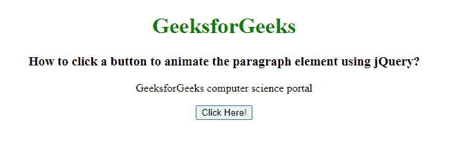
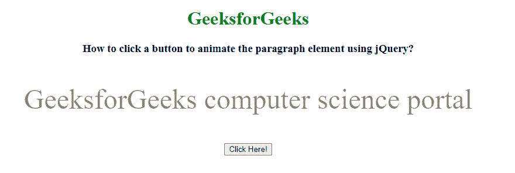

# 如何使用 jQuery 点击按钮动画化段落元素？

> 原文:[https://www . geesforgeks . org/如何使用 jquery 点击按钮来动画化段落元素/](https://www.geeksforgeeks.org/how-to-click-a-button-to-animate-the-paragraph-element-using-jquery/)

在本文中，我们将使用 jQuery 点击一个按钮来激活段落元素。要激活段落元素，我们使用 animate()方法。animate()方法用于以 CSS 样式更改元素的状态。此方法也可用于更改 CSS 属性，为选定元素创建动画效果。

**语法:**

```html
$(selector).animate({styles}, para1, para2, para3);
```

**示例:**

## 超文本标记语言

```html
<!DOCTYPE html>
<html lang="en">

<head>
    <title>
        How to click a button to animate
        the paragraph element using jQuery?
    </title>

    <!-- Import jQuery cdn library -->
    <script src=
"https://ajax.googleapis.com/ajax/libs/jquery/3.3.1/jquery.min.js">
    </script>

    <script>
        $(document).ready(function () {
            $("button").click(function () {
                $("#GFG").animate({
                    opacity: 0.5,
                    fontSize: "3em",
                }, 1000);
            });
        });
    </script>
</head>

<body style="text-align: center;">
    <h1 style="color: green;">
        GeeksforGeeks
    </h1>

    <h3>
        How to click a button to animate
        the paragraph element using jQuery?
    </h3>

    <p id="GFG">
        GeeksforGeeks computer science portal
    </p>

    <button>Click Here!</button>
</body>

</html>
```

**输出:**

**点击按钮前:**

 **点击按钮后:**

