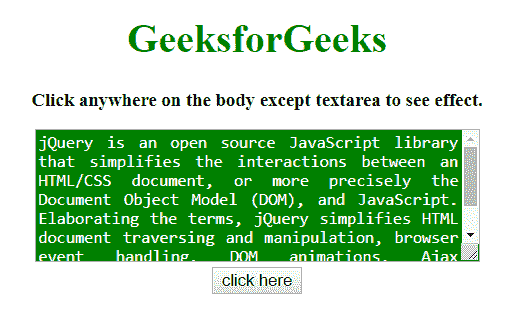
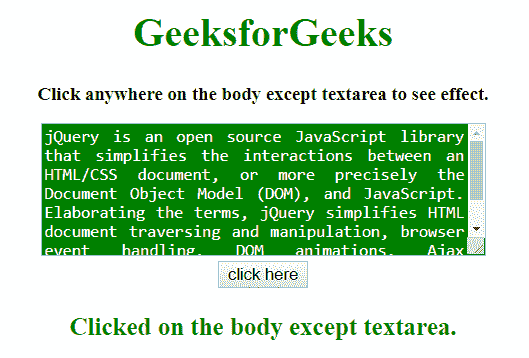

# 如何使用 jQuery 点击页面上除一个元素以外的任何地方？

> 原文:[https://www . geeksforgeeks . org/如何在页面上的任何地方单击-除了一个元素-使用-jquery/](https://www.geeksforgeeks.org/how-to-click-anywhere-on-the-page-except-one-element-using-jquery/)

一个包含许多元素的网页，任务是使用 jQuery 点击页面上除一个元素之外的任何地方。有两种方法可以解决这个问题，讨论如下:

**方法 1:**

*   这种方法在点击事件发生时调用一个函数。
*   首先检查目标元素的 id，如果匹配就返回函数。
*   否则，执行一些操作让知道某个地方被点击了。

**示例:**该示例实现了上述方法。

```
<!DOCTYPE HTML> 
<html> 

<head> 
    <title> 
        How to click anywhere of page
        except one element using jQuery ?
    </title>

    <script src=
"https://ajax.googleapis.com/ajax/libs/jquery/3.4.1/jquery.min.js">
    </script>

    <style>
        body {
            height: auto;
        }
        #t {
            height: 100px;
            width: 350px;
            background: green;
            color: white;
            text-align:justify;
        }
    </style>
</head> 

<body style = "text-align:center;">

    <h1 style = "color:green;" > 
        GeeksforGeeks 
    </h1>

    <p id = "GFG_UP" style =
        "font-size: 15px; font-weight: bold;">
    </p>

    <textarea id = "t">
        jQuery is an open source JavaScript library
        that simplifies the interactions between an
        HTML/CSS document, or more precisely the 
        Document Object Model (DOM), and JavaScript.
        Elaborating the terms, jQuery simplifies
        HTML document traversing and manipulation,
        browser event handling, DOM animations, 
        Ajax interactions, and cross-browser
        JavaScript development.
    </textarea>
    <br>

    <button onclick = "gfg_Run()"> 
        click here
    </button>

    <p id = "GFG_DOWN" style = "color:green;
        font-size: 20px; font-weight: bold;">
    </p>

    <script>
        var el_up = document.getElementById("GFG_UP");
        var el_down = document.getElementById("GFG_DOWN");

        el_up.innerHTML = "Click anywhere on the body "
                     + "except textarea to see effect.";

        $('body').click(function(evnt) {

            if(evnt.target.id == "t")
                return;
            if($(evnt.target).closest('t').length)
                return;

            el_down.innerHTML = "Clicked on the "
                        + "body except textarea.";
        });
    </script> 
</body> 

</html>
```

**输出:**

*   **点击按钮前:**
    
*   **点击元素后:**
    

**方法 2:**

*   这种方法在任何点击事件发生时调用一个函数。
*   如果是其他的 HTML 元素，那么什么也不要做。
*   否则，使用**event . stopperpagement()**方法停止事件的发生。

**示例:**该示例实现了上述方法。

```
<!DOCTYPE HTML> 
<html> 

<head> 
    <title> 
        How to click anywhere of page
        except one element using jQuery ?
    </title>

    <script src=
"https://ajax.googleapis.com/ajax/libs/jquery/3.4.1/jquery.min.js">
    </script>

    <style>
        body {
            height: auto;
        }
        #t {
            height: 100px;
            width: 350px;
            background: green;
            color: white;
            text-align:justify;
        }
    </style>
</head> 

<body style = "text-align:center;">

    <h1 style = "color:green;" > 
        GeeksforGeeks 
    </h1>

    <p id = "GFG_UP" style =
        "font-size: 15px; font-weight: bold;">
    </p>

    <textarea id = "t">
        jQuery is an open source JavaScript library
        that simplifies the interactions between an
        HTML/CSS document, or more precisely the 
        Document Object Model (DOM), and JavaScript.
        Elaborating the terms, jQuery simplifies
        HTML document traversing and manipulation,
        browser event handling, DOM animations, 
        Ajax interactions, and cross-browser
        JavaScript development.
    </textarea>
    <br>

    <button onclick = "gfg_Run()"> 
        click here
    </button>

    <p id = "GFG_DOWN" style = "color:green;
        font-size: 20px; font-weight: bold;">
    </p>

    <script>
        var el_up = document.getElementById("GFG_UP");
        var el_down = document.getElementById("GFG_DOWN");

        el_up.innerHTML =  "Click anywhere on the body"
                    + " except textarea to see effect.";

        $('html').click(function() {
            el_down.innerHTML = "Clicked on the body"
                        + " except textarea.";
        });

        $('#t').click(function(event) {
            event.stopPropagation();
        });
    </script> 
</body> 

</html>
```

**输出:**

*   **点击按钮前:**
    

*   **点击元素后:**
    