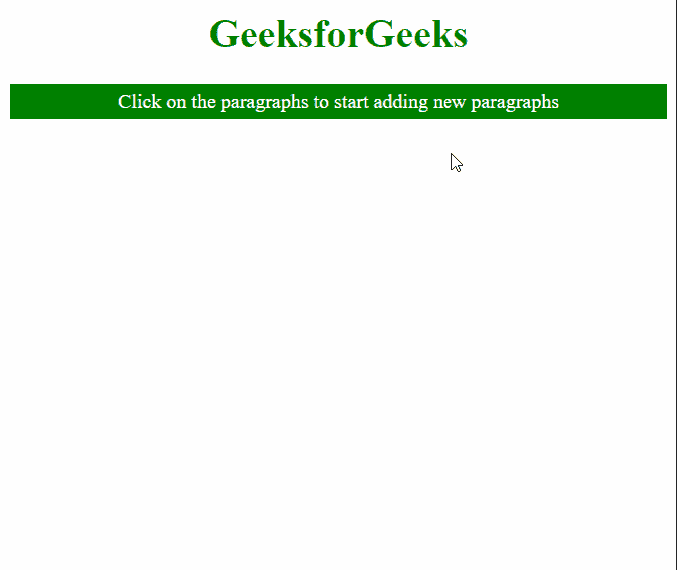

# 如何使用 jQuery 点击一个段落并添加另一个段落？

> 原文:[https://www . geeksforgeeks . org/如何使用 jquery 点击一个段落并添加另一个段落/](https://www.geeksforgeeks.org/how-to-click-on-a-paragraph-and-add-another-paragraph-using-jquery/)

在本文中，我们将学习如何在使用 jQuery 单击段落时向文档中添加另一个段落。

**方法:**我们将使用 jQuery 的 **delegate()** 和 **after()** 方法。 **delegate()** 方法用于向给定元素添加事件侦听器。这将用于向段落元素添加单击事件侦听器。这个方法取三个参数，在我们的例子中，子选择器是段落元素，事件是“点击”，函数是匿名函数。

匿名回调函数用于向文档添加新段落。这是使用在文档中所选元素之后插入给定元素的方法完成的。我们将使用*这个*绑定作为选择器，在当前段落元素之后插入一个新的段落元素。因此，这将在单击的段落元素之后向文档中添加一个段落元素。我们还可以添加一个计数器变量来查看其效果。

**语法:**

```
$(selector).delegate("target_elem", function() {
   $(this).after("content");
})
```

下面的例子演示了这种方法。

**示例:**

## 超文本标记语言

```
<html>
<head>
  <style>
    p {
      background: green;
      color: white;
      padding: 5px;
    }
  </style>

  <!--Include the jQuery library-->
  <script src=
"https://code.jquery.com/jquery-git.js">
  </script>

</head>
<body style="text-align: center;">
  <h1 style="color: green;">
    GeeksforGeeks 
  </h1>
  <p>
    Click on the paragraphs to start
    adding new paragraphs
  </p>

  <script>

    // A count variable to keep track
    // of the current paragraph 
    let cnt = 0;

    // Add the click event listener to
    // the required paragraph element
    $("body").delegate("p", "click", 
                       function() {

      // Insert a new paragraph after
      // this paragraph
      $(this).after(
        "<p>New paragraph " +
        cnt + "</p>
        ");

      cnt++;
    });
  </script>
</body>
</html>
```

**输出:**

