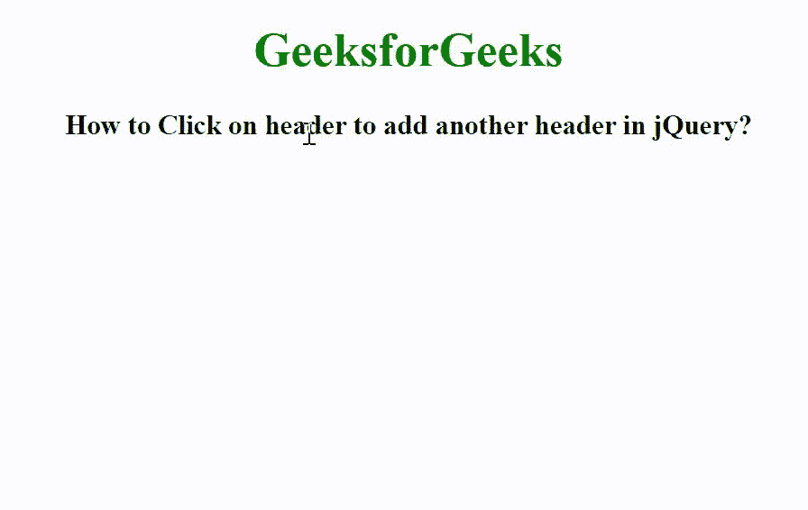

# 如何在 jQuery 中点击表头添加另一个表头？

> 原文:[https://www . geeksforgeeks . org/如何点击标题-添加另一个标题-in-jquery/](https://www.geeksforgeeks.org/how-to-click-on-header-to-add-another-header-in-jquery/)

在本文中，我们将看到如何在 jQuery 中单击现有的标题元素后添加一个新的标题元素。若要添加新的标头元素，请使用 delegate()方法。

**语法:**

```
$(selector).delegate("Selected_elements", function() {
    $(this).after("content");
})
```

这里，我们使用 delegate()方法向指定的元素添加一个或多个事件处理程序，这些事件处理程序是选定元素的子元素。此外，我们使用 after()方法插入内容，该内容由匹配元素集中每个选定元素的参数指定。

**示例:**

## 超文本标记语言

```
<!DOCTYPE html>
<html>

<head>
    <title>
        How to Click on header to add
        another header in jQuery?
    </title>

    <script src=
"https://ajax.googleapis.com/ajax/libs/jquery/3.3.1/jquery.min.js">
    </script>

    <script>
        $(document).ready(function () {
            $("body").delegate("h1, h3", "click", function () {
                $(this).after("<h4>Added Another Header!</h4>");
            });
        });
    </script>

    <style>
        body {
            text-align: center;
        }

        h1 {
            color: green;
        }
    </style>
</head>

<body>
    <h1>GeeksforGeeks</h1>

    <h3>
        How to Click on header to add
        another header in jQuery?
    </h3>
</body>

</html>
```

**输出:**

