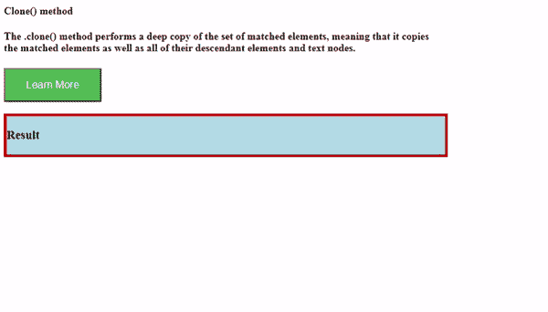
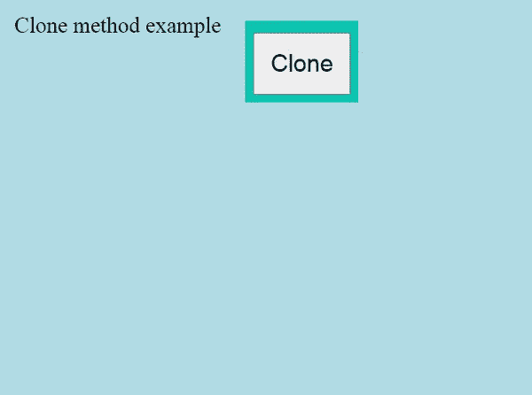

# 如何使用 jQuery 克隆一个块？

> 原文:[https://www . geeksforgeeks . org/如何使用-jquery 克隆数据块/](https://www.geeksforgeeks.org/how-to-clone-a-block-using-jquery/)

jQuery 中的 Clone 方法执行一组匹配元素的深度复制。您可以创建数据的副本以及事件处理程序的副本。

**语法:**

```html
$(selector).clone(true|false)
```

**参数值:**

*   **True** 指定也应该复制事件处理程序
*   **假(默认)**事件处理程序不应被复制的种类。

**示例 1:** 在本例中，我们没有向克隆方法传递任何值。

## 超文本标记语言

```html
<!DOCTYPE html>
<html>

<head>
    <script type="text/javascript" src=
        "https://code.jquery.com/jquery-1.12.0.min.js">
    </script>

    <style>
        #info {
            justify-content: center;
            width: 50%;
        }

        #container {
            border: 4px outset red;
            background-color: lightblue;
            justify-content: center;
            width: 50%;
        }

        #btn {
            background-color: #4CAF50;
            color: white;
            padding: 15px 32px;
            text-align: center;
            display: inline-block;
            font-size: 16px;
        }
    </style>

    <script>
        $(document).ready(function () {
            $("button").click(function () {
                $("#info").clone().appendTo("#container");
            });
        });
    </script>
</head>

<body>
    <div id="info">
        <h4>Clone() method<h4>

        <p>
            The .clone() method performs a deep 
            copy of the set of matched elements,
            meaning that it copies the matched 
            elements as well as all of their
            descendant elements and text nodes.
        </p>
    </div>

    <button id="btn"> Learn More</button>
    <br><br>

    <div id="container">
        <h3> Result </h3>
    </div>
</body>

</html>
```

**输出:**



**示例 2:** 在本例中，我们将“true”值传递给克隆方法，该方法也复制事件处理程序。在这里，每当用户单击段落时，我们都会更改段落的背景颜色。正如您在输出中看到的，这将被复制。

## 超文本标记语言

```html
<!DOCTYPE html>
<html>

<head>
    <script type="text/javascript" src=
        "https://code.jquery.com/jquery-1.12.0.min.js">
    </script>

    <style>
        body {
            background-color: lightblue;
        }

        #main {
            text-align: center;
            margin: 20px 300px;
            padding: 10px;
            background-color: #00b3b3;
            display: inline-block;
            position: absolute;
        }

        button {
            padding: 20px;
            font-size: 30px;
            margin-top: 05px;
        }

        p {
            padding: 10px;
            font-size: 28px;
        }
    </style>

    <script>
        $(document).ready(function () {
            $("button").click(function () {
                $("body").append($("p:first").clone(true));
            });

            $("p").click(function () {
                $(this).css("background-color", "yellow");
            });

        });
    </script>
</head>

<body>
    <div id="main">
        <button id="clone"> Clone </button>
    </div>

    <p>Clone method example</p>
</body>

</html>
```

**输出:**

