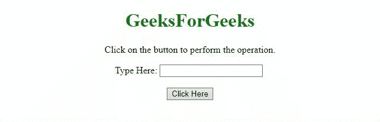

# 如何使用 jQuery 将字符串的首字母转换为大写？

> 原文:[https://www . geesforgeks . org/如何使用-jquery/](https://www.geeksforgeeks.org/how-to-convert-first-letter-of-a-string-to-upper-case-using-jquery/) 将字符串的第一个字母转换为大写字母

任务是在 jQuery 的帮助下，不使用**to ppercase()方法**将字符串的第一个字母大写。下面讨论两种方法:

**方法 1:** 在本例中， [**css()方法**](https://www.geeksforgeeks.org/jquery-css-method/) 用于将**文本转换属性**的值设置为**大写**。

**示例:**

```
<!DOCTYPE HTML> 
<html> 

<head> 
    <title> 
        How to convert first letter of a
        string to upper case using jQuery?
    </title>

    <script src=
"https://ajax.googleapis.com/ajax/libs/jquery/3.4.0/jquery.min.js">
    </script>
</head> 

<body style = "text-align:center;"> 

    <h1 style = "color:green;" > 
        GeeksForGeeks 
    </h1>

    <p>
        Click on the button to
        perform the operation.
    </p>

    Type Here: <input id = "input"/>
    <br><br>

    <button onclick = "GFG_Fun()">
        Click Here
    </button>

    <p id = "GFG"></p>

    <script>
        var geeks = document.getElementById('GFG');

        function GFG_Fun() {
            $('#input').css('textTransform', 'capitalize');
            geeks.innerHTML = "Text is capitalized";
        }
    </script> 
</body> 

</html>
```

**输出:**


**方法 2:** 在本例中，我们使用 CSS 属性来执行操作。元素中添加了一个新的标识，将属性**文本转换**设置为**大写**。

**示例:**

```
<!DOCTYPE HTML> 
<html> 

<head> 
    <title> 
        How to convert first letter of a
        string to upper case using jQuery?
    </title>

    <script src=
"https://ajax.googleapis.com/ajax/libs/jquery/3.4.0/jquery.min.js">
    </script>

    <style>
        #capital {
            text-transform: capitalize;
        }
    </style>
</head> 

<body style = "text-align:center;"> 

    <h1 style = "color:green;" > 
        GeeksForGeeks 
    </h1>

    <p>
        Click on the button to
        perform the operation.
    </p>

    Type Here: <input id = "input"/>
    <br><br>

    <button onclick = "GFG_Fun()">
        Click Here
    </button>

    <p id = "GFG"></p>

    <script>
        var geeks = document.getElementById('GFG');

        function GFG_Fun() {
            $('#input').attr('id', 'capital');
            geeks.innerHTML = "Text is capitalized";
        }
    </script> 
</body> 

</html>
```

**输出:**
