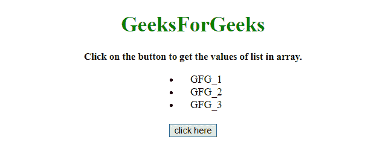
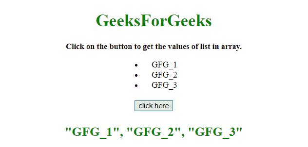

# 如何使用 jQuery 转换数组中的元素列表？

> 原文:[https://www . geeksforgeeks . org/如何使用-jquery 转换数组中的元素列表/](https://www.geeksforgeeks.org/how-to-convert-list-of-elements-in-an-array-using-jquery/)

给定一个包含元素列表的 HTML 文档，任务是获取 HTML 列表的值，并使用 JavaScript 将其转换为数组。

**进场:**

*   列一个清单(有序/无序)。
*   选择
*   元素的父元素，并为父元素(**)的每个子元素调用一个匿名函数。每个()或。地图()方法**)。
*   获取每个子级的文本值，并将其附加到数组中。

**例 1:** 本例使用。方法来转换数组中的元素列表。

```
<!DOCTYPE HTML>  
<html>  

<head>  
    <title>  
        How to convert list of elements
        in an array using jQuery ?
    </title>

    <script src=
"https://ajax.googleapis.com/ajax/libs/jquery/3.4.1/jquery.min.js">
    </script>

    <style>
        #ul {
            width: 80px;
            margin: 0 auto;
        }
    </style>
</head>  

<body align = "center">  

    <h1 style = "color:green;" >  
        GeeksForGeeks  
    </h1> 

    <p id = "GFG_UP" style = 
            "font-size: 15px; font-weight: bold;"> 
    </p>

    <ul id = "ul">
        <li>GFG_1</li>
        <li>GFG_2</li>
        <li>GFG_3</li>
    </ul>

    <br>

    <button onclick = "GFG_Fun()">
        click here
    </button>

    <p id = "GFG_DOWN" style = 
        "font-size: 24px; font-weight: bold; color: green;"> 
    </p>

    <script>  
        var el_up = document.getElementById('GFG_UP');
        var el_down = document.getElementById('GFG_DOWN');

        el_up.innerHTML = "Click on the button to get "
                    + "the values of list in array."; 

        function GFG_Fun() {
            var arr = [];
            $("ul li").each(function() { arr.push($(this).text())});
            el_down.innerHTML = '"' + arr.join('", "') + '"';
        } 
    </script>  
</body>  

</html>
```

**输出:**

*   **点击按钮前:**
    
*   **点击按钮后:**
    

**例 2:** 本例使用。map()方法转换数组中的元素列表。

```
<!DOCTYPE HTML>  
<html>  

<head>  
    <title>  
        How to convert list of elements
        in an array using jQuery ?
    </title>

    <script src=
"https://ajax.googleapis.com/ajax/libs/jquery/3.4.1/jquery.min.js">
    </script>

    <style>
        #ul {
            width: 80px;
            margin: 0 auto;
        }
    </style>
</head>  

<body align = "center">  

    <h1 style = "color:green;" >  
        GeeksForGeeks  
    </h1> 

    <p id = "GFG_UP" style = 
        "font-size: 15px; font-weight: bold;"> 
    </p>

    <ul id = "ul">
        <li>GFG_1</li>
        <li>GFG_2</li>
        <li>GFG_3</li>
    </ul>

    <br>

    <button onclick = "GFG_Fun()">
        click here
    </button>

    <p id = "GFG_DOWN" style = 
        "font-size: 24px; font-weight: bold; color: green;"> 
    </p>

    <script>  
        var el_up = document.getElementById('GFG_UP');
        var el_down = document.getElementById('GFG_DOWN');

        el_up.innerHTML = "Click on the button to get "
                    + "the values of list in array."; 

        function GFG_Fun() {
            var arr = [];
            arr = $('li').map(function(j, element) {
                return $(element).text();
            }).get();

            el_down.innerHTML = '"' + arr.join('", "') + '"';
        } 
    </script>  
</body>  

</html>
```

**输出:**

*   **点击按钮前:**
    
*   **点击按钮后:**
    