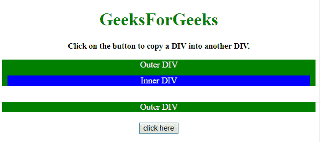
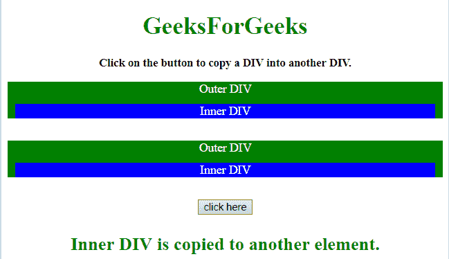

# 如何使用 jQuery 将一个 div 的内容复制到另一个 div 中？

> 原文:[https://www . geeksforgeeks . org/如何使用-jquery/](https://www.geeksforgeeks.org/how-to-copy-the-content-of-a-div-into-another-div-using-jquery/) 将一个部门的内容复制到另一个部门

给定一个包含某个 div 元素的 HTML 文档，任务是使用 jQuery 将一个 div 内容复制到另一个 div 中作为它的子级。有两种方法可以解决这个问题，讨论如下:

**方法 1:**

*   首先，选择需要复制到另一个 div 元素中的 div 元素。
*   选择复制 div eleemtn 的目标元素。
*   使用 **[追加()方法](https://www.geeksforgeeks.org/jquery-append-method/)** 将元素复制为其子元素。

**示例:**本示例使用 [append()方法](https://www.geeksforgeeks.org/jquery-append-method/)将 div 元素复制到另一个 div 中。

```html
<!DOCTYPE HTML>  
<html>  

<head>  
    <title>  
        How to copy the content of a div 
        into another div using jQuery ?
    </title>

    <script src=
"https://ajax.googleapis.com/ajax/libs/jquery/3.4.1/jquery.min.js">
    </script>

    <style>
        .parent {
            background: green;
            color: white;
        }
        .child {
            background: blue;
            color: white;
            margin: 10px;
        }  
        #GFG_UP {
            font-size: 15px;
            font-weight: bold;
        }
        #GFG_DOWN {
            font-size: 24px;
            font-weight: bold;
            color: green;
        }
    </style>
</head>  

<body id = "body" style = "text-align:center;">  

    <h1 style = "color:green;" >  
        GeeksForGeeks  
    </h1> 

    <p id = "GFG_UP"></p>

    <div class="parent">
        Outer DIV
        <div class="child">
            Inner DIV
        </div>
    </div>

    <br>

    <div class="parent" id = "parent2">
        Outer DIV
    </div>
    <br>

    <button onclick = "GFG_Fun()">
        click here
    </button>

    <p id = "GFG_DOWN"></p>

    <script>  
        var up = document.getElementById('GFG_UP');
        var down = document.getElementById('GFG_DOWN');
        up.innerHTML = "Click on the button to "
                + "copy a DIV into another DIV."; 

        function GFG_Fun() {
            var $el = $('.child').clone();
            $('#parent2').append($el);
            down.innerHTML = "Inner DIV is copied "
                    + "to another element.";
        } 
    </script>  
</body>  

</html>
```

**输出:**

*   **点击按钮前:**
    
*   **点击按钮后:**
    

**方法 2:**

*   首先，选择需要复制到另一个 div 元素中的 div 元素。
*   选择复制 div eleemtn 的目标元素。
*   使用 **[appendTo()方法](https://www.geeksforgeeks.org/jquery-appendto-with-examples/)** 将元素复制为其子元素。

**示例:**本示例使用 [appendTo()方法](https://www.geeksforgeeks.org/jquery-appendto-with-examples/)将 div 元素复制到另一个 div 中。

```html
<!DOCTYPE HTML>  
<html>  

<head>  
    <title>  
        How to copy the content of a div 
        into another div using jQuery ?
    </title>

    <script src=
"https://ajax.googleapis.com/ajax/libs/jquery/3.4.1/jquery.min.js">
    </script>

    <style>
        .parent {
            background: green;
            color: white;
        }
        .child {
            background: blue;
            color: white;
            margin: 10px;
        }  
        #GFG_UP {
            font-size: 15px;
            font-weight: bold;
        }
        #GFG_DOWN {
            font-size: 24px;
            font-weight: bold;
            color: green;
        }
    </style>
</head>  

<body id = "body" style = "text-align:center;">  

    <h1 style = "color:green;" >  
        GeeksForGeeks  
    </h1> 

    <p id = "GFG_UP"></p>

    <div class="parent">
        Outer DIV
        <div class="child">
            Inner DIV
        </div>
    </div>

    <br>

    <div class="parent" id = "parent2">
        Outer DIV
    </div>
    <br>

    <button onclick = "GFG_Fun()">
        click here
    </button>

    <p id = "GFG_DOWN"></p>

    <script>  
        var up = document.getElementById('GFG_UP');
        var down = document.getElementById('GFG_DOWN');
        up.innerHTML = "Click on the button to "
                + "copy a DIV into another DIV."; 

        function GFG_Fun() {
            $('.child').clone().appendTo('#parent2');
            down.innerHTML = "Inner DIV is copied"
                        + " to another element.";
        } 
    </script>  
</body>  

</html>
```

**输出:**

*   **点击按钮前:**
    
*   **点击按钮后:**
    