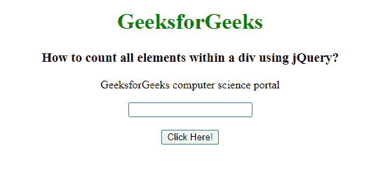
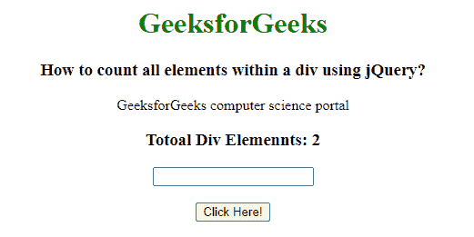

# 如何使用 jQuery 统计 div 内的所有元素？

> 原文:[https://www . geeksforgeeks . org/如何使用-jquery/](https://www.geeksforgeeks.org/how-to-count-all-elements-within-a-div-using-jquery/) 计算 div 中的所有元素

在本文中，我们将使用 jQuery 计算 div 元素中的所有元素。为了计算 div 元素中的所有元素，我们使用 find()方法和 length 属性。

**find()方法**用于查找所选元素的所有后代元素。它将一直向下遍历到 DOM 树中所选元素的最后一片叶子。

**语法:**

```html
$(selector).find()
```

这里的选择器是被选择的元素，所有的后代元素都将被找到。

**长度属性**用于统计 jQuery 对象的元素数量。

**语法:**

```html
$(selector).length
```

**注意:**这里选择器是要计算长度的对象。

**示例:**

## 超文本标记语言

```html
<!DOCTYPE html>
<html lang="en">

<head>

    <!-- Import jQuery cdn library -->
    <script src=
"https://ajax.googleapis.com/ajax/libs/jquery/3.3.1/jquery.min.js">
    </script>

    <script>
        $(document).ready(function () {
            $("button").click(function () {
                var count = $(".GFG").find("*").length;
                $("p").after("<h3>Totoal Div Elemennts: "
                    + count);
            });
        });
    </script>
</head>

<body style="text-align: center;">
    <h1 style="color: green;">
        GeeksforGeeks
    </h1>

    <h3>
        How to count all elements
        within a div using jQuery?
    </h3>

    <div class="GFG">
        <p>
            GeeksforGeeks computer 
            science portal
        </p>

        <input type="text">
    </div><br>

    <button>Click Here!</button>
</body>

</html>
```

**输出:**

**点击按钮前:**



**点击按钮后:**

