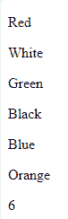

# 如何使用 jQuery 统计子元素？

> 原文:[https://www . geesforgeks . org/how-to-count-child-element-use-jquery/](https://www.geeksforgeeks.org/how-to-count-child-element-using-jquery/)

使用 jQuery 计算 HTML 文件中子元素的数量非常简单。例如:如果您有一个由许多子元素组成的父元素，那么您可以使用**。length or.children()。长度法**如下图。

**语法:**

```
var len=$("#parentID").length;

```

或者

```
var count = $("#parentId").children().length;
```

**例 1:**

```
<!DOCTYPE html>
<html>

<head>
    <meta charset="utf-8">
    <meta http-equiv="X-UA-Compatible" content="IE=edge">
    <title>Count child elements using Jquery</title>
    <meta name="viewport" 
          content="width=device-width, initial-scale=1">
    <link rel="stylesheet" href="">
</head>

<body>
    <div id="parentID">
        <p>Red</p>
        <p>White</p>
        <p>Green</p>
        <p>Black</p>
        <p>Blue</p>
        <p>Orange</p>
    </div>

    <script src="https://code.jquery.com/jquery-3.5.0.min.js"
integrity="sha256-xNzN2a4ltkB44Mc/Jz3pT4iU1cmeR0FkXs4pru/JxaQ=" 
        crossorigin="anonymous">
    </script>

    <script>

        // Here we count the child element in parentID
        var count = $("#parentID p").length;
        document.writeln(count);
    </script>
</body>

</html>
```

**输出:**


**例 2:**

```
<!DOCTYPE html>
<html>

<head>
   <meta charset="utf-8">
   <meta name="viewport" content="width=device-width">
   <title>Count child elements using  jQuery.</title>
   <script src=
      "https://code.jquery.com/jquery-3.4.1.js">
    </script>
</head>

<body>
   <div id="parentId">
   <ul>
      <li>1 child</li>
      <li>2 child</li>
      <li>3 child</li>
      <li>4 child</li>
      <li>5 child</li>
    </ul>
    </div>
    <script>
         var count = $("#parentId ul").children().length;
         document.writeln(count);
    </script>
</body>

</html>
```

**输出:**
