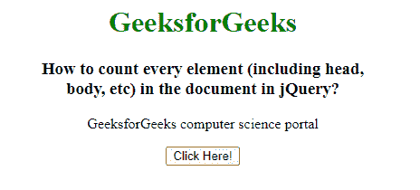
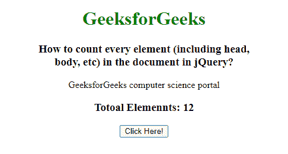

# jQuery 中如何统计文档中包括头体在内的每个元素？

> 原文:[https://www . geeksforgeeks . org/如何在 jquery 文档中计算每个元素(包括头部和身体)/](https://www.geeksforgeeks.org/how-to-count-every-element-including-head-body-in-the-document-in-jquery/)

在本文中，我们将使用 jQuery 计算文档中的每个元素(包括头部、主体等)。为了计算所有的 HTML 元素，我们使用长度属性。length 属性用于计算 jQuery 对象的元素数量。

**语法:**

```html
$(selector).length
```

其中选择器是要计算其长度的对象。

**示例:**

## 超文本标记语言

```html
<!DOCTYPE html>
<html lang="en">

<head>

    <!-- Import jQuery cdn library -->
    <script src=
 "https://ajax.googleapis.com/ajax/libs/jquery/3.3.1/jquery.min.js">
    </script>

    <script>
        $(document).ready(function () {
            $("button").click(function () {
                var count = $(".GFG").find("*").length;
                $("p").after("<h3>Totoal Div Elements: "
                    + count);
            });
        });
    </script>
</head>

<body style="text-align: center;">
    <h1 style="color: green;">
        GeeksforGeeks
    </h1>

    <h3>
        How to count all elements
        within a div using jQuery?
    </h3>

    <div class="GFG">

<p>
        GeeksforGeeks computer
        science portal
    </p>

        <input type="text">
    </div><br>

    <button>Click Here!</button>
</body>

</html>
```

**输出:**

**点击按钮前:**



**点击按钮后:**

