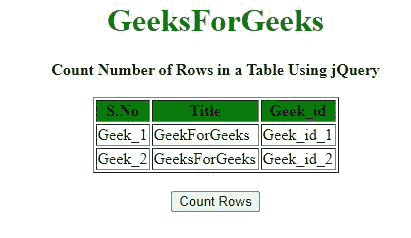
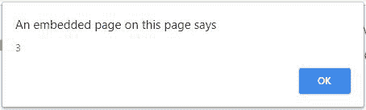
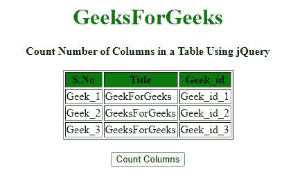

# 如何使用 jQuery 统计表格中的行数和列数？

> 原文:[https://www . geeksforgeeks . org/如何使用-jquery 计算表中的行数和列数/](https://www.geeksforgeeks.org/how-to-count-number-of-rows-and-columns-in-a-table-using-jquery/)

给定一个包含表的 HTML 文档，任务是使用 JQuery 计算该表中的行数和列数。

**方法:****长度属性**用于使用 jQuery 计算 HTML 表格中的行数和列数。用于查找 HTML 表中行数和列数的选择器有:

*   要计算行数，使用**“# Table _ Id tr”**选择器。它选择表中所有的< tr >元素。这包括包含表格标题的行。length 属性用于所选元素以获取行数。
*   要计算列数，使用**“# Table _ Id tr th”**选择器。它选择表格中嵌套在< tr >元素内的所有数量的<第>元素。length 属性用于所选元素，以获取列数。

**例 1:** 在本例中，计算行数。

## 超文本标记语言

```html
<!DOCTYPE HTML> 
<html> 
  <head> 
    <title> 
      Count Number of Rows and Columns in 
      a Table Using jQuery.
    </title> 

    <script src = 
"https://ajax.googleapis.com/ajax/libs/jquery/3.4.0/jquery.min.js"> 
    </script> 
  </head> 

  <body> 
    <center>     
      <h1 style = "color:green;" > 
        GeeksForGeeks 
      </h1> 

      <strong> 
        Count Number of Rows in 
        a Table Using jQuery
      </strong> 

      <br><br> 

      <table id="Table_id" border="1" width="140">
        <thead>

          <tr style = "background:green;"> 
            <th>S.No</th> 
            <th>Title</th> 
            <th>Geek_id</th> 
          </tr> 
        </thead>
        <tbody>
          <tr> 
            <td>Geek_1</td> 
            <td>GeekForGeeks</td> 
            <td>Geek_id_1</td> 
          </tr> 
          <tr> 
            <td>Geek_2</td> 
            <td>GeeksForGeeks</td> 
            <td>Geek_id_2</td> 
          </tr> 
        </tbody>
      </table> 
      <br> 

      <button type="button"> 
        Count Rows 
      </button> 

      <!-- Script to Count number of rows in a table -->
      <script>
        $(document).ready(function(){
          $("button").click(function(){

            // Select all the rows in the table
            // and get the count of the selected elements
            var rowCount = $("#Table_id tr").length;
            alert(rowCount); 
          });
        });
      </script> 
    </center> 
  </body> 
</html>                     
```

**输出:**

*   **点击按钮前:**



*   **点击按钮后:**



**例 2:** 在本例中，计算列数。

## 超文本标记语言

```html
<!DOCTYPE HTML> 
<html> 
  <head> 
    <title> 
      Count Number of Rows and Columns in 
      a Table Using jQuery.
    </title> 

    <script src = 
"https://ajax.googleapis.com/ajax/libs/jquery/3.4.0/jquery.min.js"> 
    </script> 
  </head> 

  <body> 
    <center>     
      <h1 style = "color:green;" > 
        GeeksForGeeks 
      </h1> 

      <strong> 
        Count Number of Columns in 
        a Table Using jQuery
      </strong> 

      <br><br> 

      <table id="Table_id" border="1" width="140">
        <thead>

          <tr style = "background:green;"> 
            <th>S.No</th> 
            <th>Title</th> 
            <th>Geek_id</th> 
          </tr> 
        </thead>
        <tbody>
          <tr> 
            <td>Geek_1</td> 
            <td>GeekForGeeks</td> 
            <td>Geek_id_1</td> 
          </tr> 
          <tr> 
            <td>Geek_2</td> 
            <td>GeeksForGeeks</td> 
            <td>Geek_id_2</td> 
          </tr> 
          <tr> 
            <td>Geek_3</td> 
            <td>GeeksForGeeks</td> 
            <td>Geek_id_3</td> 
          </tr> 
        </tbody>
      </table> 
      <br> 

      <button type="button"> 
        Count Columns 
      </button> 

      <!-- Script to Count Number of columns in a table -->
      <script>
        $(document).ready(function(){
          $("button").click(function(){

            // Select all the columns in the table
            // and get the count of the selected elements
            var colCount = $("#Table_id tr th").length;
            alert(colCount); 
          });
        });
      </script> 
    </center> 
  </body> 
</html>                     
```

**输出:**

*   **点击按钮前:**



*   **点击按钮后:**


jQuery 是一个开源的 JavaScript 库，它简化了 HTML/CSS 文档之间的交互，它以其“少写多做”的理念而闻名。
跟随本 [jQuery 教程](https://www.geeksforgeeks.org/jquery-tutorials/)和 [jQuery 示例](https://www.geeksforgeeks.org/jquery-examples/)可以从头开始学习 jQuery。