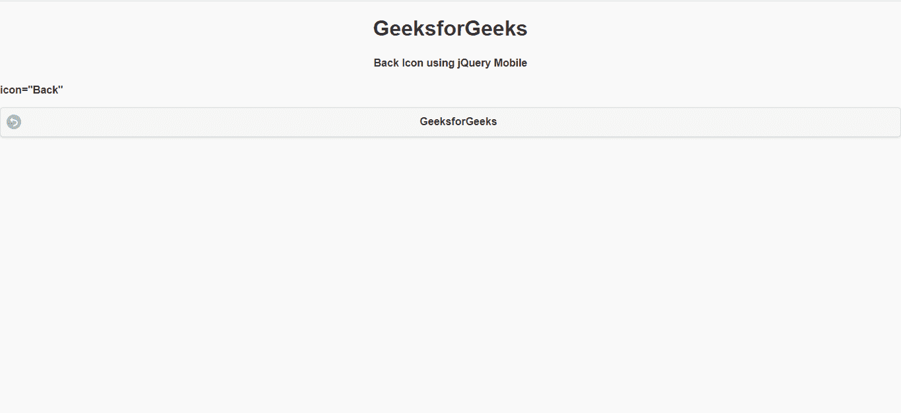

# 如何使用 jQuery Mobile 创建后退图标？

> 原文:[https://www . geeksforgeeks . org/如何使用-jquery-mobile/](https://www.geeksforgeeks.org/how-to-create-a-back-icon-using-jquery-mobile/) 创建后退图标

**jQuery Mobile** 是一种基于网络的技术，用于制作可在所有智能手机、平板电脑和台式机上访问的响应内容。在本文中，我们将使用 **jQuery Mobile** 制作一个后退图标。

**方法:**首先，添加项目所需的 jQuery Mobile 脚本。

> <link rel="”stylesheet”" href="”http://code.jquery.com/mobile/1.4.5/jquery.mobile-1.4.5.min.css”/">
> <脚本 src = " http://code . jquery . com/jquery-1 . 11 . 1 . min . js "></脚本>
> <脚本 src = " http://code . jquery . com/mobile/1 . 4 . 5/jquery . mobile-1 . 4 . 5 . min . js "></脚本>

**示例 1:** 在本例中，后退图标与超链接一起使用。

## 超文本标记语言

```html
<!DOCTYPE html>
<html>

<head>
    <link rel="stylesheet" href=
"http://code.jquery.com/mobile/1.4.5/jquery.mobile-1.4.5.min.css" />

    <script src=
        "http://code.jquery.com/jquery-1.11.1.min.js">
    </script>

    <script src=
"http://code.jquery.com/mobile/1.4.5/jquery.mobile-1.4.5.min.js">
    </script>
</head>

<body>
    <center>
        <h1>GeeksforGeeks</h1>
        <h4>Back Icon using jQuery Mobile</h4>
    </center>

    <p><strong>icon="Back"</strong></p>

    <a href="https://www.geeksforgeeks.org/"
        data-role="button" data-icon="back">
        GeeksforGeeks
    </a>
</body>

</html>
```

**输出:**



**示例 2:** 在本例中，后退图标与按钮一起使用。

## 超文本标记语言

```html
<!DOCTYPE html>
<html>

<head>
    <link rel="stylesheet" href=
"http://code.jquery.com/mobile/1.4.5/jquery.mobile-1.4.5.min.css" />

    <script src=
        "http://code.jquery.com/jquery-1.11.1.min.js">
    </script>

    <script src=
"http://code.jquery.com/mobile/1.4.5/jquery.mobile-1.4.5.min.js">
    </script>
</head>

<body>
    <center>
        <h1>GeeksforGeeks</h1>
        <h4>Back Icon using jQuery Mobile</h4>
    </center>

    <p><strong>icon="Back"</strong></p>

    <button id="gfg" data-role="button" 
        data-icon="back">
        GeeksforGeeks
    </button>
</body>

</html>
```

**输出:**

