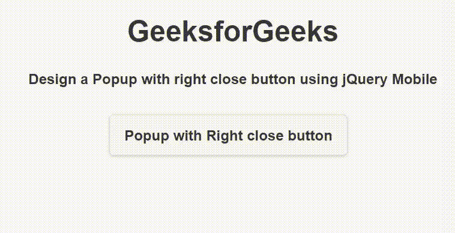
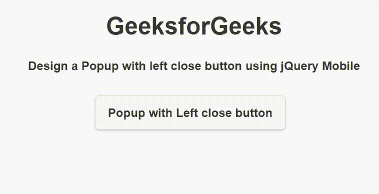

# 如何使用 jQuery Mobile 创建关闭弹出窗口？

> 原文:[https://www . geeksforgeeks . org/如何创建-关闭-弹出-使用-jquery-mobile/](https://www.geeksforgeeks.org/how-to-create-a-closing-popup-using-jquery-mobile/)

**jQuery Mobile** 是一种基于网络的技术，用于制作可在所有智能手机、平板电脑和台式机上访问的响应内容。在本文中，我们将使用 **jQuery Mobile 创建一个关闭弹出窗口。**

**方法:**添加项目所需的 jQuery Mobile 脚本。

> <link rel="”stylesheet”" href="”http://code.jquery.com/mobile/1.4.5/jquery.mobile-1.4.5.min.css”">
> <脚本 src = " http://code . jquery . com/jquery-1 . 11 . 1 . min . js "></脚本>
> <脚本 src = " http://code . jquery . com/mobile/1 . 4 . 5/jquery . mobile-1 . 4 . 5 . min . js "></脚本>

我们将创建一个包含关闭按钮的弹出窗口。关闭按钮可以放在*左上方*或*右上方*或其他基于类别的地方。可以通过单击弹出窗口小部件的外部或按下 *Esc* 键来关闭弹出窗口。*数据消除=“假”*属性用于防止用户在弹出框外点击时关闭弹出窗口。

**示例 1:** 我们将在*右上角*创建一个包含关闭按钮的弹出窗口。

## 超文本标记语言

```html
<!DOCTYPE html>
<html>

<head>
    <link rel="stylesheet" href=
"http://code.jquery.com/mobile/1.4.5/jquery.mobile-1.4.5.min.css" />

    <script src=
        "http://code.jquery.com/jquery-1.11.1.min.js">
    </script>

    <script src=
"http://code.jquery.com/mobile/1.4.5/jquery.mobile-1.4.5.min.js">
    </script>
</head>

<body>
    <center>
        <h1>GeeksforGeeks</h1>

        <h4>
            Design a Popup with right close 
            button using jQuery Mobile
        </h4>

        <a href="#CloseRightPopup" data-rel="popup" 
            class="ui-btn ui-corner-all ui-shadow ui-btn-inline">
            Popup with Right close button
        </a>

        <div data-role="popup" id="CloseRightPopup" 
            class="ui-content" style="max-width:280px">
            <a href="#" data-rel="back"
                class="ui-btn ui-corner-all ui-shadow 
                ui-btn-a ui-icon-delete ui-btn-icon-notext 
                ui-btn-right">
                Close
            </a>

            <p>
                It is an example of popup with 
                closing of top-right corner.
            </p>
        </div>
    </center>
</body>

</html>
```

**输出:**



**示例 2:** 我们将在*左上角*创建一个包含关闭按钮的弹出窗口。

## 超文本标记语言

```html
<!DOCTYPE html>
<html>

<head>
    <link rel="stylesheet" href=   
"http://code.jquery.com/mobile/1.4.5/jquery.mobile-1.4.5.min.css" />

    <script src=
        "http://code.jquery.com/jquery-1.11.1.min.js">
    </script>

    <script src=
"http://code.jquery.com/mobile/1.4.5/jquery.mobile-1.4.5.min.js">
    </script>
</head>

<body>
    <center>
        <h1>GeeksforGeeks</h1>

        <h4>
            Design a Popup with left close
            button using jQuery Mobile
        </h4>

        <a href="#CloseLeftPopup" 
            data-rel="popup" 
            class="ui-btn ui-corner-all ui-shadow 
            ui-btn-inline">
            Popup with Left close button
        </a>

        <div data-role="popup" id="CloseLeftPopup" 
            class="ui-content" style="max-width:280px">
            <a href="#" data-rel="back"
                class="ui-btn ui-corner-all ui-shadow 
                ui-btn-a ui-icon-delete ui-btn-icon-notext 
                ui-btn-left">
                Close
            </a>

            <p>
                It is an example of popup with 
                closing of top-left corner.
            </p>
        </div>
    </center>
</body>

</html>
```

**输出:**

