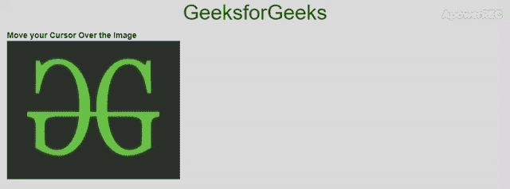

# 如何使用 jQuery 创建自定义图像放大镜？

> 原文:[https://www . geeksforgeeks . org/如何使用-jquery/](https://www.geeksforgeeks.org/how-to-create-a-custom-image-magnifier-using-jquery/) 创建自定义图像放大镜

**影像放大镜一瞥:**


图像放大镜是光标点的缩放功能。当您将光标放在定义 div 中时，图像将在缩放模式下弹出。就像在购物网站上，当你想购买任何一种布料，并想详细检查该产品上的材料或印花时，这个功能是有用的。为了创建一个图像放大镜，我们将使用 zoom()函数。有一篇类似的文章[如何使用 JavaScript 进行图像的放大和缩小？](https://www.geeksforgeeks.org/how-to-zoom-in-and-zoom-out-image-using-javascript/)将放大整个画面。

我们将使用 jQuery 构建一个图像放大镜。以下是一些**先决条件**我们希望你在开始开发这个之前有一些基本的知识:

*   超文本标记语言
*   半铸钢ˌ钢性铸铁(Cast Semi-Steel)
*   jQuery
*   引导程序

**逼近:**使用 jQuery offset()获取页面坐标和鼠标位置，得到光标相对于元素的相对位置。将外部容器**显示**属性设置为**块/内嵌块**，这样无论何时缩放，图像都不会溢出。每当触发缩放时，设置相对于容器的顶部/左侧位置。在不同的用例中，我们需要相对于容器来校准图像缩放，这需要时间。因此，出于同样的原因，我们将使用一个简单的 jQuery 核心插件 **jQuery zoom** ，这样做可以节省我们很多时间。

**创建结构:**在本节中，我们将创建一个基本结构。首先，我们将进行页面布局

*   **HTML 代码制作结构:**

    ```html
    <!DOCTYPE html>
    <html lang="en">

    <head>
        <meta charset="utf-8" />

        <!-- Required CDN's -->
        <link rel="stylesheet"
              href=
    "https://maxcdn.bootstrapcdn.com/bootstrap/3.4.0/css/bootstrap.min.css">
        <script src=
    "https://ajax.googleapis.com/ajax/libs/jquery/3.3.1/jquery.min.js">
        </script>
        <script src=
    "https://maxcdn.bootstrapcdn.com/bootstrap/3.4.0/js/bootstrap.min.js">
        </script>
        <script src=
    "https://cdnjs.cloudflare.com/ajax/libs/jquery-zoom/1.7.21/jquery.zoom.js">
        </script> 
    </head>

    <body>
        <center>
            <h1>GeeksforGeeks</h1>
        </center>
        <div class="container-fluid">
            <b>Move your Cursor Over the Image</b>
            <div class="parent">
                
            </div>

            <span class="contain">
                <!-- Into another container -->
            </span>
        </div>
    </body>

    </html>
    ```

**设计结构:**在上一节中，我们已经创建了基本布局的结构，我们将在其中使用放大镜。

*   **CSS 代码的结构:**在这一节中，我们将设计布局添加一些必要的 CSS 配置来做同样的事情。在**容器**中应用的样式属性可确保图像不会溢出容器，也不会溢出指定的边界。更多细节请参考下面的例子。

    ```html
    <style>
        body {
            margin: 20px;
        }
        h1 {
            color: green;
        }
        .container {
            display: block;
            padding: 0px;
        }
        .contain {
            position: fixed;
            right: 15%;
            top: 15%;
            width: 200px;
            height: 220px;
        }
        img {
            width: 300px;
            height: 240px;
        }
    </style>
    ```

*   **Adding jQuery script:** Now we will initialize the jQuery script. The syntax is highlighted below:

    ```html
    $([Selector to Parent element of Image]).zoom({Attributes});
    $([Image]).parent().zoom({attributes});
    ```

    ```html
    <script>
        $(document).ready(function() {

            $('.parent').css('width', $('img').width());

            $('img').parent().zoom({
                magnify: 4,
                target: $('.contain').get(0)
            });
        });
    </script>
    ```

    **使用图像的父元素作为选择器的原因:**根据 Git-hub 存储库文档，很难从 JavaScript/jQuery 中读取一些与 CSS 样式相关的布局，所以我们在这里使用父元素来做同样的事情，这同时也是作为图像的包装器。

    **缩放()功能的属性:**

    | 财产 | 默认 | 描述 |
    | 在 | 鼠标悬停 | 用于触发缩放的事件。选项:鼠标悬停、抓取、点击、切换 |
    | 期间 | One hundred and twenty | 褪色效果的速度。 |
    | 目标 | 错误的 | 用作缩放图像的父容器的选择器/DOM 元素。 |
    | 触控 | 真实的 | 使用触摸实现交互。 |
    | 放大 | one | 输入的值乘以图像分辨率进行缩放。 |
    | 回收 | 错误的 | 加载图像后调用的函数。 |
    | onZoomIn | 错误的 | 图像放大后调用的函数。 |
    | 在动物园 | 错误的 | 图像缩小时调用的函数。 |

    **合并 HTML、CSS 和 jQuery 代码:**这是合并上述部分后的最终代码。

    ```html
    <!DOCTYPE html>
    <html lang="en">

    <head>
        <meta charset="utf-8" />

        <!-- Required CDN's -->
        <link rel="stylesheet"
              href=
    "https://maxcdn.bootstrapcdn.com/bootstrap/3.4.0/css/bootstrap.min.css">
        <script src=
    "https://ajax.googleapis.com/ajax/libs/jquery/3.3.1/jquery.min.js">
        </script>
        <script src=
    "https://maxcdn.bootstrapcdn.com/bootstrap/3.4.0/js/bootstrap.min.js">
        </script>
        <script src=
    "https://cdnjs.cloudflare.com/ajax/libs/jquery-zoom/1.7.21/jquery.zoom.js">
        </script>

        <style>
            body {
                margin: 20px;
            }
            h1 {
                color: green;
            }
            .container {
                display: block;
                padding: 0px;
            }

            .contain {
                position: fixed;
                right: 15%;
                top: 15%;
                width: 200px;
                height: 220px;
            }

            img {
                width: 300px;
                height: 240px;
            }
        </style>
    </head>

    <body>
        <center>
            <h1>GeeksforGeeks</h1>
        </center>
        <div class="container-fluid">
            <b>Move your Cursor Over the Image</b>
            <div class="parent">
                
            </div>

            <span class="contain">
            <!-- Into another container -->
        </span>
        </div>

        <script>
            $(document).ready(function() {

                $('.parent').css('width', $('img').width());

                $('img')
                    .parent()
                    .zoom({
                        magnify: 4,
                        target: $('.contain').get(0)
                    });
            });
        </script>
    </body>

    </html>            
    ```

    **输出:**
    