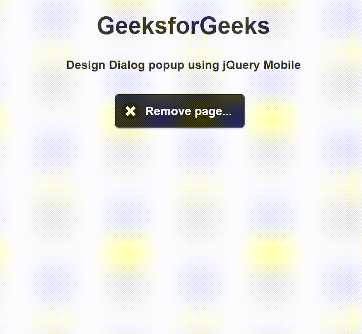

# 如何使用 jQuery Mobile 创建对话框弹出窗口？

> 原文:[https://www . geesforgeks . org/how-create-a-dialog-popup-use-jquery-mobile/](https://www.geeksforgeeks.org/how-to-create-a-dialog-popup-using-jquery-mobile/)

jQuery Mobile 是一种基于网络的技术，用于制作可在所有智能手机、平板电脑和台式机上访问的响应内容。在本文中，我们将使用 jQuery Mobile 创建一个对话框弹出按钮。

**方法:**添加项目所需的 jQuery Mobile 脚本。

> <link rel="”stylesheet”" href="”http://code.jquery.com/mobile/1.4.5/jquery.mobile-1.4.5.min.css”">

**示例:**我们将创建一个可以放入弹出窗口的对话框。我们将添加*数据消除=“假”*属性，以防止用户在对话框外单击时弹出关闭。

## 超文本标记语言

```html
<!DOCTYPE html>
<html>

<head>
    <link rel="stylesheet" href=
"http://code.jquery.com/mobile/1.4.5/jquery.mobile-1.4.5.min.css" />

    <script src=
        "http://code.jquery.com/jquery-1.11.1.min.js">
    </script>

    <script src=
"http://code.jquery.com/mobile/1.4.5/jquery.mobile-1.4.5.min.js">
    </script>
</head>

<body>
    <center>
        <h1>GeeksforGeeks</h1>

        <h4>
            Design Dialog popup using jQuery Mobile
        </h4>

        <a href="#DialogBox" data-rel="popup" 
            data-position-to="window" data-transition="pop"
            class="ui-btn ui-corner-all ui-shadow ui-btn-inline 
            ui-icon-delete ui-btn-icon-left ui-btn-b">
            Remove page...
        </a>

        <div data-role="popup" id="DialogBox" 
            data-overlay-theme="b" data-theme="b" 
            data-dismissible="false"
            style="max-width:400px;">

            <div data-role="header" data-theme="a">
                <h1>Remove Page?</h1>
            </div>

            <div role="main" class="ui-content">
                <h3 class="ui-title">
                    Are you want to remove GeeksforGeeks page?
                </h3>

                <a href="#" class="ui-btn ui-corner-all 
                    ui-shadow ui-btn-inline ui-btn-b" 
                    data-rel="back">Cancel
                </a>

                <a href="#" class="ui-btn ui-corner-all 
                    ui-shadow ui-btn-inline ui-btn-b" 
                    data-rel="back" data-transition="flow">
                    Remove
                </a>
            </div>
        </div>
    </center>
</body>

</html>
```

**输出:**

