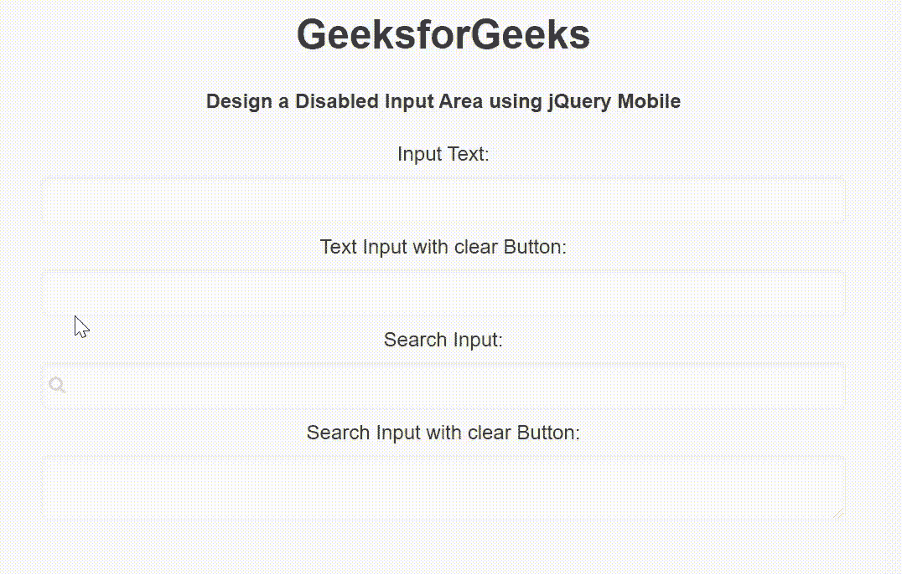

# 如何使用 jQuery Mobile 创建禁用输入？

> 原文:[https://www . geeksforgeeks . org/如何创建-禁用-输入-使用-jquery-mobile/](https://www.geeksforgeeks.org/how-to-create-a-disabled-input-using-jquery-mobile/)

jQuery Mobile 是一种基于网络的技术，用于制作可在所有智能手机、平板电脑和台式机上访问的响应内容。在本文中，我们将使用 jQuery Mobile 创建一个禁用的输入。

**方法:**添加项目所需的 jQuery Mobile 脚本。

> <link rel="”stylesheet”" href="”http://code.jquery.com/mobile/1.4.5/jquery.mobile-1.4.5.min.css”">
> <脚本 src = " http://code . jquery . com/jquery-1 . 11 . 1 . min . js "></脚本>
> <脚本 src = " http://code . jquery . com/mobile/1 . 4 . 5/jquery . mobile-1 . 4 . 5 . min . js "></脚本>

**示例:**我们将使用 jQuery Mobile 创建一个禁用输入区域。我们使用 disabled =“disabled”属性来禁用输入区域。

## 超文本标记语言

```
<!DOCTYPE html>
<html>

<head>
    <link rel="stylesheet" href=
"http://code.jquery.com/mobile/1.4.5/jquery.mobile-1.4.5.min.css" />

    <script src=
        "http://code.jquery.com/jquery-1.11.1.min.js">
    </script>

    <script src=
"http://code.jquery.com/mobile/1.4.5/jquery.mobile-1.4.5.min.js">
    </script>
</head>

<body>
    <center>
        <h1>GeeksforGeeks</h1>

        <h4>
            Design a Disabled Input Area
            using jQuery Mobile
        </h4>

        <form style="width: 50%;">
            <label for="TextInput1">
                Input Text:
            </label>
            <input type="text" data-clear-btn="false" 
                disabled="disabled" name="TextInput1" 
                id="TextInput1" value="">

            <label for="TextInput2">
                Text Input with clear Button:
            </label>
            <input type="text" data-clear-btn="true" 
                disabled="disabled" name="TextInput2" 
                id="TextInput2" value="">

            <label for="searchInput1">
                Search Input:
            </label>
            <input type="search" name="searchInput1" 
                disabled="disabled" id="searchInput1" value="">

            <label for="textareaInput">
                Search Input with clear Button:
            </label>
            <textarea cols="40" rows="8" name="textareaInput" 
                disabled="disabled" id="textareaInput"
                value=""></textarea>
        </form>
    </center>
</body>

</html>
```

**输出:**

