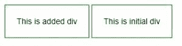
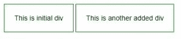
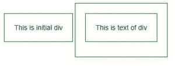

# 如何在 jQuery 中创建 div 元素？

> 原文:[https://www . geesforgeks . org/如何在 jquery 中创建 div 元素/](https://www.geeksforgeeks.org/how-to-create-a-div-element-in-jquery/)

有多种方法可以使用 JQuery 在 HTML 文档中创建 HTML 元素。但最简单的是**追加()**和**前置()**的方法。

**方法 1:使用 [prepend()方法](https://www.geeksforgeeks.org/jquery-prepend-with-examples/):**prepend()方法用于在所选元素的开头插入指定的内容。

**示例:**本示例使用 prepend()方法在选定元素的开头创建 div 元素。

```
<!DOCTYPE html>
<html>

<head>
    <title>Create div element</title>

    <script src=" 
https://ajax.googleapis.com/ajax/libs/jquery/3.3.1/jquery.min.js"> 
    </script> 

    <!-- Script to add div element in the HTML document -->
    <script>
        $(document).ready(function() {

            // Select the element inside div
            // element will be added
            $("body")

            .prepend('<div class="added">This is added div </div>');
        });
    </script>

    <!-- Style to use on div element -->
    <style>
        div {
            padding: 20px;
            margin-bottom: 10px;
            border: 1px solid green;
            display: inline-block;
        }
    </style>
</head>

<body>
    <div class="initial">
        This is initial div
    </div>
</html>                    
```

**输出:**


**方法二:使用[appendo()方法](https://www.geeksforgeeks.org/jquery-appendto-with-examples/):**jQuery 中的 appendo()方法用于在所选元素的末尾插入 HTML 元素。

**示例 1:** 本示例使用 appendTo()方法在选定元素的末尾创建 div 元素。

```
<!DOCTYPE html>
<html>

<head>
    <title>Create div element</title>

    <script src=" 
https://ajax.googleapis.com/ajax/libs/jquery/3.3.1/jquery.min.js"> 
    </script> 

    <!-- Script to add div element at the end of document -->
    <script>
        $(document).ready(function() {
            $("<div>This is another added div</div>").appendTo("body");
        });
    </script>

    <!-- Style to use on div element -->
    <style>
        div{
            padding: 20px;
            margin-bottom: 10px;
            border: 1px solid green;
            display: inline-block;
        }
    </style>
</head>

<body>
    <div class="initial">
    This is initial div
    </div>
</body>

</html>                    
```

**输出:**


**示例 2:** 本示例使用 appendTo()方法在 div 元素内创建 div 元素。

```
<!DOCTYPE html>
<html>

<head>
    <title>Create div element</title>

    <script src=" 
https://ajax.googleapis.com/ajax/libs/jquery/3.3.1/jquery.min.js"> 
    </script> 

    <!-- Script to create div element -->
    <script>
        $(document).ready(function() {
            jQuery("<div/>", {
                id: "div-id",
                class: "div-class",
                text: "This is text of div"
            }).appendTo(".box");
        });
    </script>

    <!-- Style to add on div element -->
    <style>
        div {
            padding: 20px;
            margin-bottom: 10px;
            border: 1px solid green;
            display: inline-block;
        }
    </style>
</head>

<body>
    <div class="initial">
        This is initial div
    </div>

    <div class="box"></div>
</body>

</html>                    
```

**输出:**
