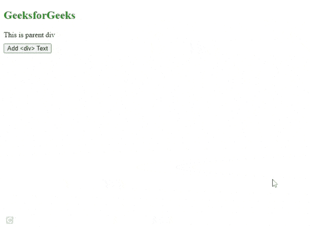
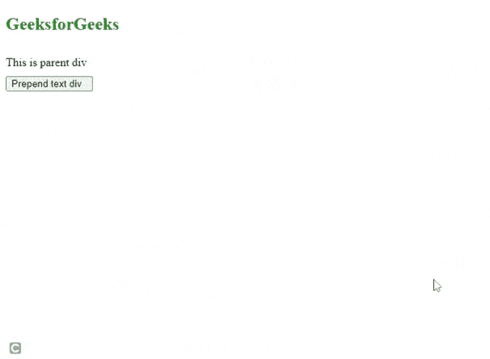

# 如何使用带有样式标签的 jQuery 创建 div？

> 原文:[https://www . geeksforgeeks . org/如何使用-jquery-with-style-tag/](https://www.geeksforgeeks.org/how-to-create-a-div-using-jquery-with-style-tag/) 创建 div

使用 jQuery 创建一个带有样式标签的*[*<>*](https://www.geeksforgeeks.org/div-tag-html/)元素可以通过以下步骤完成。*

***步骤:***

*   *创建一个新的 *< div >* 元素。*
*   *用我们想要应用的所有样式创建一个对象。*
*   *选择一个父元素，将这个新创建的元素放在哪里。*
*   *将创建的 *div* 柠檬放入父元素。*

***示例 1:** 本示例将创建一个 *< div >* 元素，并使用 [*append()*](https://www.geeksforgeeks.org/jquery-append-method/) 方法将元素追加到父元素的末尾。*

## *超文本标记语言*

```
*<!DOCTYPE html>
<html>

<head>
    <script src="https://code.jquery.com/jquery-git.js">
    </script>

    <style>
        .divClass {
            height: 40px;
            width: 200px;
            border: 1px solid blue;
            color: white
        }
    </style>
</head>

<body>
    <h2 style="color:green">GeeksforGeeks</h2>
    <div id="parent">
        This is parent div
    </div>
    <div style="height:10px;"></div>
    <!-- JavaScript function addText() is called to add to parent div-->
    <input type="button" value="Add <div> Text" onclick="addText()" />
    <script>
        <!-- Function to add text in a div element with above styles-->
        function addText() {
            $(document).ready(function() {

                var object = {
                    id: "divID",
                    class: "divClass",
                    css: {
                        "color": "Red"
                    }
                };
                var addition = $("<div>", object);
                addition.html("Added text GFG");
                $("#parent").append(addition);
            });
        }
    </script>
</body>

</html>*
```

***输出:***

*

附加* 

***示例 2:** 本示例将创建一个 *< div >* 元素，并使用 [*prependTo()*](https://www.geeksforgeeks.org/jquery-prependto-with-examples/) 方法在父元素的开头追加元素。*

## *超文本标记语言*

```
*<!DOCTYPE html>
<html>

<head>
    <script src="https://code.jquery.com/jquery-git.js">
    </script>

    <style>
        .divClass {
            height: 40px;
            width: 200px;
            border: 1px solid blue;
            color: white
        }
    </style>
</head>

<body>
    <h2 style="color:green">GeeksforGeeks</h2>
    <div style="height:10px;"></div>
    <div id='parent'>
        This is parent div
    </div>
    <div style="height:10px;"></div>
    <input type="button" 
           value="Prepend text div  " 
           onclick="prependDiv()" />
    <script>
        function prependDiv() {
            $(document).ready(function() {
                var object = {
                    id: "divID",
                    class: "divClass",
                    css: {
                        "color": "Red"
                    }
                };
        <!--Prepend object is created before the parent div-->
                var prependObject = $("<div>", object);
                prependObject.html("Prepend text is GFG");
                $(prependObject).prependTo($('#parent'));
            });
        }
    </script>
</body>

</html>*
```

***输出:***

*

前置文本*