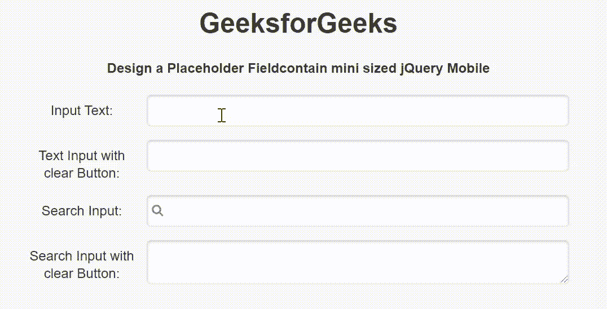

# 如何使用 jQuery Mobile 创建一个小尺寸的 Fieldcontain？

> 原文:[https://www . geeksforgeeks . org/how-create-a-field contain-mini-size-use-jquery-mobile/](https://www.geeksforgeeks.org/how-to-create-a-fieldcontain-mini-sized-using-jquery-mobile/)

jQuery Mobile 是一种基于网络的技术，用于制作可在所有智能手机、平板电脑和台式机上访问的响应内容。在本文中，我们将使用 jQuery Mobile 创建一个小型的 Fieldcontain。

**方法:**添加项目所需的 jQuery Mobile 脚本。

> <link rel="”stylesheet”" href="”http://code.jquery.com/mobile/1.4.5/jquery.mobile-1.4.5.min.css”">
> <脚本 src = " http://code . jquery . com/jquery-1 . 11 . 1 . min . js "></脚本>
> <脚本 src = " http://code . jquery . com/mobile/1 . 4 . 5/jquery . mobile-1 . 4 . 5 . min . js "></脚本>

**示例:**我们将使用 jQuery Mobile 创建一个 Fieldcontain 小型区域。我们使用 class="ui-field-contain "属性来设置最小大小的字段。

## 超文本标记语言

```
<!DOCTYPE html>
<html>

<head>
    <link rel="stylesheet" href=
"http://code.jquery.com/mobile/1.4.5/jquery.mobile-1.4.5.min.css" />

    <script src=
        "http://code.jquery.com/jquery-1.11.1.min.js">
    </script>

    <script src=
"http://code.jquery.com/mobile/1.4.5/jquery.mobile-1.4.5.min.js">
    </script>
</head>

<body>
    <center>
        <h1>GeeksforGeeks</h1>

        <h4>
            Design a Fieldcontain mini 
              sized using jQuery Mobile
        </h4>

        <form style="width: 50%;">
            <div class="ui-field-contain">
                <label for="TextInput1">Input Text:</label>
                <input type="text" data-clear-btn="false" 
                    name="TextInput1" id="TextInput1" value="">
            </div>

            <div class="ui-field-contain">
                <label for="TextInput2">
                    Text Input with clear Button:
                </label>
                <input type="text" data-clear-btn="true" 
                    name="TextInput2" id="TextInput2" value="">
            </div>

            <div class="ui-field-contain">
                <label for="searchInput1">
                    Search Input:
                </label>
                <input type="search" name="searchInput1"
                    id="searchInput1" value="">
            </div>

            <div class="ui-field-contain">
                <label for="textareaInput">
                    Search Input with clear Button:
                </label>
                <textarea cols="40" rows="8" 
                    name="textareaInput" id="textareaInput"
                    value="">
                </textarea>
            </div>
        </form>
    </center>
</body>

</html>
```

**输出:**

