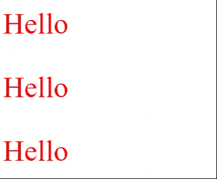

# 如何使用 jQuery 创建闪烁文本效果？

> 原文:[https://www . geesforgeks . org/如何使用-jquery/](https://www.geeksforgeeks.org/how-to-create-a-flashing-text-effect-using-jquery/) 创建闪烁文本效果

在本文中，我们将使用 jQuery 创建一个闪烁的文本。它基本上是，一个可见的文本，然后它变得不可见，再一次，它回到原来的可见性，这个过程不断重复，然后它被称为闪烁的文本。

使用 jQuery，创建闪烁或闪烁的文本非常简单。jquery 中有一些内置的方法，我们将使用它们来创建闪烁的文本。我们有一个 jQuery 方法 [**fadeOut()**](https://www.geeksforgeeks.org/jquery-effect-fadeout-method/) 将可见元素转换为隐藏元素，还有一个方法 [**fadeIn()**](https://www.geeksforgeeks.org/jquery-fadein-method/) 将隐藏元素转换为可见元素。

**Fadein 效果:**我们要在每个元素上使用 CSS 标记 [*显示:none*](https://www.geeksforgeeks.org/css-display-property/) ，来展示 *fadeIn()* 方法的工作情况。

## 超文本标记语言

```
<!DOCTYPE html>
<html lang="en">

<head>

    <!-- Using jquery library -->
    <script src=
"https://code.jquery.com/jquery-git.js">
    </script>  

    <style>
        p {
            color: red;
            font-size: 40px;
            display: none;
        }
    </style>
</head>

<body>
    <p id="a">Hello</p>
    <p id="b">Hello</p>
    <p id="c">Hello</p>

    <script>

        // Fast fade in
        $("#a").fadeIn("fast")

        //  Slow fade in
        $("#b").fadeIn("slow")

        // Fade in in 4s
        $("#c").fadeIn(4000)
    </script>
</body>

</html>
```

**输出:**



**淡出:**以下示例演示了 jQuery *淡出()*方法。

## 超文本标记语言

```
<!DOCTYPE html>
<html lang="en">

<head>

    <!-- Using jquery library -->
    <script src=
"https://code.jquery.com/jquery-git.js">
    </script>  

    <style>
        p {
            color:blue;
            font-size: 40px;
        }
    </style> 
</head>

<body>
    <p id="a">Hello</p>
    <p id="b">Hello</p>
    <p id="c">Hello</p>

    <script>

        // Fade out in 4s
        $("#a").fadeOut(1500)

        //  Slow fade out
        $("#b").fadeOut("slow")

        // Fast fade out
        $("#c").fadeOut("fast")
    </script>
</body>

</html>
```

**输出:**


**最终代码:**当以上两种方法同时使用时，结果会是一个闪烁的文本。但是上面代码的问题是文本只会闪烁一次。所以要反复做这个过程，我们可以使用 jQuery[**setInterval(**](https://www.geeksforgeeks.org/java-script-settimeout-setinterval-method/)**)**功能。

## 超文本标记语言

```
<!DOCTYPE html>
<html lang="en">

<head>

    <!-- Using jquery library -->
    <script src=
"https://code.jquery.com/jquery-git.js">
    </script>

    <style>
        p {
            color: blue;
            font-size: 40px;
        }
    </style>
</head>

<body>
    <p id="a">Hello</p>

    <script>
        setInterval(function () {
            $("#a").fadeOut(200)
            $("#a").fadeIn(200)
        },100)
    </script>
</body>

</html>
```

**输出:**

