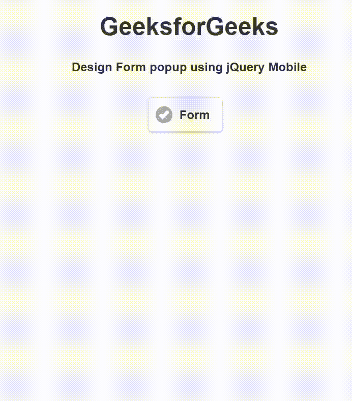

# 如何使用 jQuery Mobile 创建表单弹出窗口？

> 原文:[https://www . geeksforgeeks . org/如何创建表单-弹出-使用-jquery-mobile/](https://www.geeksforgeeks.org/how-to-create-a-form-popup-using-jquery-mobile/)

jQuery Mobile 是一种基于网络的技术，用于制作可在所有智能手机、平板电脑和台式机上访问的响应内容。在本文中，我们将使用 jQuery Mobile 创建一个表单弹出窗口。

**方法:**添加项目所需的 jQuery Mobile 脚本。

> <link rel="”stylesheet”" href="”http://code.jquery.com/mobile/1.4.5/jquery.mobile-1.4.5.min.css”">

**示例:**我们将在弹出窗口中创建一个表单。当我们点击按钮时，它会打开一个表单。

## 超文本标记语言

```
<!DOCTYPE html>
<html>

<head>
    <link rel="stylesheet" href=
"http://code.jquery.com/mobile/1.4.5/jquery.mobile-1.4.5.min.css" />

    <script src=
        "http://code.jquery.com/jquery-1.11.1.min.js">
    </script>

    <script src=
"http://code.jquery.com/mobile/1.4.5/jquery.mobile-1.4.5.min.js">
    </script>
</head>

<body>
    <center>
        <h1>GeeksforGeeks</h1>

        <h4>
            Design Form popup using jQuery Mobile
        </h4>

        <a href="#FormDesign" data-rel="popup" 
            data-position-to="window"
            class="ui-btn ui-corner-all ui-shadow 
            ui-btn-inline ui-icon-check 
            ui-btn-icon-left ui-btn-a"
            data-transition="pop">Form
        </a>

        <div data-role="popup" id="FormDesign" 
            data-theme="a" class="ui-corner-all">

            <form>
                <div style="padding:10px 20px;">
                    <h3>GeeksforGeeks Login Form</h3>

                    <label for="un" class="ui-hidden-accessible">
                        First Name:
                    </label>

                    <input type="text" name="user" id="un" value="" 
                        placeholder="Enter First Name" data-theme="a">

                    <label for="un" class="ui-hidden-accessible">
                        Last Name:
                    </label>

                    <input type="text" name="user" id="un" value=""
                        placeholder="Enter Last Name" data-theme="a">

                    <label for="un" class="ui-hidden-accessible">
                        Username:
                    </label>

                    <input type="text" name="user" id="un" value=""
                        placeholder="Enter Username" data-theme="a">

                    <label for="pw" class="ui-hidden-accessible">
                        Password:
                    </label>

                    <input type="password" name="pass" id="pw" value=""
                        placeholder="Enter Password" data-theme="a">

                    <label for="pw" class="ui-hidden-accessible">
                        Confirm Password:
                    </label>

                    <input type="password" name="pass" id="pw" 
                        value="" placeholder="Enter Confirm Password"
                        data-theme="a">

                    <button type="submit"
                        class="ui-btn ui-corner-all ui-shadow 
                        ui-btn-b ui-btn-icon-left ui-icon-check">
                        Sign UP
                    </button>    
                </div>
            </form>
        </div>
    </center>
</body>

</html>
```

**输出:**

