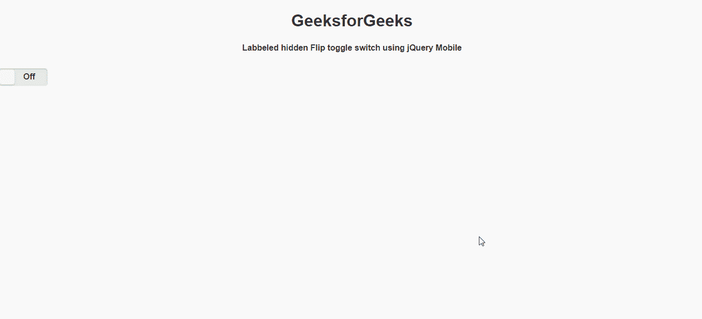

# 如何使用 jQuery Mobile 创建标签隐藏翻转开关？

> 原文:[https://www . geesforgeks . org/如何创建标签-隐藏-翻转-切换-切换-使用-jquery-mobile/](https://www.geeksforgeeks.org/how-to-create-a-label-hidden-flip-toggle-switch-using-jquery-mobile/)

jQuery Mobile 是一种基于网络的技术，用于制作可在所有智能手机、平板电脑和台式机上访问的响应内容。在本文中，我们将使用 jQuery Mobile 制作标签隐藏翻转开关。

**方法:**首先，添加项目所需的 jQuery Mobile 脚本。

> <link rel="”stylesheet”" href="”http://code.jquery.com/mobile/1.4.5/jquery.mobile-1.4.5.min.css”">
> <脚本 src = " http://code . jquery . com/jquery-1 . 11 . 1 . min . js "></脚本>
> <脚本 src = " http://code . jquery . com/mobile/1 . 4 . 5/jquery . mobile-1 . 4 . 5 . min . js "></脚本>

**例 1:**

```
<!DOCTYPE html> 
<html>
   <head>
      <link rel="stylesheet" 
         href=
"http://code.jquery.com/mobile/1.4.5/jquery.mobile-1.4.5.min.css" />
      <script 
         src=
"http://code.jquery.com/jquery-1.11.1.min.js"></script>
      <script 
         src=
"http://code.jquery.com/mobile/1.4.5/jquery.mobile-1.4.5.min.js">
      </script>
   </head>
   <body>
      <center>
         <h1>GeeksforGeeks</h1>
         <h4>Labbeled hidden Flip toggle 
             switch using jQuery Mobile</h4>
      </center>
      <form>
         <label for="geeks-1" 
                class="ui-hidden-accessible">
                   Flip toggle switch
         </label>
         <select name="geeks-1" 
                 id="geeks-1" 
                 data-role="slider">
            <option value="off">Off</option>
            <option value="on">On</option>
         </select>
      </form>
   </body>
</html>
```

**输出:**

