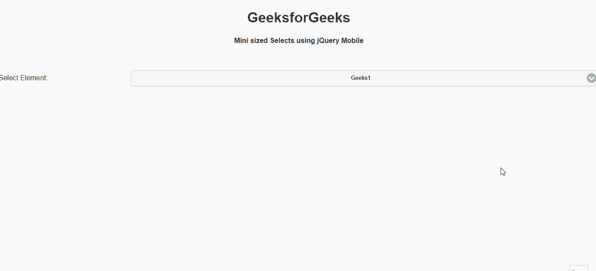

# 如何使用 jQuery Mobile 创建迷你大小的选择？

> 原文:[https://www . geeksforgeeks . org/如何使用 jquery-mobile/](https://www.geeksforgeeks.org/how-to-create-a-mini-sized-selects-using-jquery-mobile/) 创建迷你大小的选择

**jQuery Mobile** 是一种基于网络的技术，用于制作可在所有智能手机、平板电脑和台式机上访问的响应内容。在本文中，我们将使用 jQuery Mobile 创建一个迷你大小的选择。

**方法:**首先，添加项目所需的 jQuery Mobile 脚本。

> <link rel="”stylesheet”" href="”http://code.jquery.com/mobile/1.4.5/jquery.mobile-1.4.5.min.css”/">
> <脚本 src = " http://code . jquery . com/jquery-1 . 11 . 1 . min . js "></脚本>
> <脚本 src = " http://code . jquery . com/mobile/1 . 4 . 5/jquery . mobile-1 . 4 . 5 . min . js "></脚本>

**示例:**

## 超文本标记语言

```html
<!DOCTYPE html>
<html>

<head>
    <link rel="stylesheet" href=
"http://code.jquery.com/mobile/1.4.5/jquery.mobile-1.4.5.min.css" />

    <script src=
        "http://code.jquery.com/jquery-1.11.1.min.js">
    </script>

    <script src=
"http://code.jquery.com/mobile/1.4.5/jquery.mobile-1.4.5.min.js">
    </script>
</head>

<body>
    <center>
        <h1>GeeksforGeeks</h1>

        <h4>
            Mini sized Selects using
            jQuery Mobile
        </h4>
    </center>

    <form>
        <div data-role="fieldcontain">
            <label for="Geeks">Select Element:</label>
            <select name="Geeks" id="Geeks" data-mini="true">
                <option value="1">Geeks1</option>
                <option value="2">Geeks2</option>
                <option value="3">Geeks3</option>
                <option value="4">Geeks4</option>
            </select>
        </div>
    </form>
</body>

</html>
```

**输出:**

