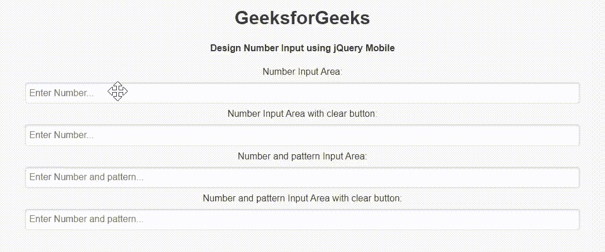

# 如何使用 jQuery Mobile 创建数字输入？

> 原文:[https://www . geeksforgeeks . org/如何创建号码-输入-使用-jquery-mobile/](https://www.geeksforgeeks.org/how-to-create-a-number-input-using-jquery-mobile/)

jQuery Mobile 是一种基于网络的技术，用于制作可在所有智能手机、平板电脑和台式机上访问的响应内容在本文中，我们将使用 jQuery Mobile 创建一个数字输入区域。

**方法:**添加项目所需的 jQuery Mobile 脚本。

> <link rel="”stylesheet”" href="”http://code.jquery.com/mobile/1.4.5/jquery.mobile-1.4.5.min.css”">

**示例:**我们将使用 jQuery Mobile 创建一个数字输入区域。我们使用 *type="number"* 属性只输入数字，使用 *data-clear-btn="true"* 属性清除输入文本。

## 超文本标记语言

```html
<!DOCTYPE html>
<html>

<head>
    <link rel="stylesheet" href=
"http://code.jquery.com/mobile/1.4.5/jquery.mobile-1.4.5.min.css" />

    <script src="http://code.jquery.com/jquery-1.11.1.min.js">
    </script>

    <script src=
"http://code.jquery.com/mobile/1.4.5/jquery.mobile-1.4.5.min.js">
    </script>
</head>

<body>
    <center>
        <h1>GeeksforGeeks</h1>

        <h4>
            Design Number Input using jQuery Mobile
        </h4>

        <form style="width: 50%;">
            <label for="numberInput1">Number Input Area:</label>
            <input type="number" data-clear-btn="false" 
                name="numberInput1" id="numberInput1" value=""
                placeholder="Enter Number...">

            <label for="numberInput2">
                Number Input Area with clear button:
            </label>
            <input type="number" data-clear-btn="true" 
                name="numberInput2" id="numberInput2" value=""
                placeholder="Enter Number...">

            <label for="numberInput3">
                Number and pattern Input Area:
            </label>
            <input type="number" data-clear-btn="false" 
                name="numberInput3" pattern="[0-9]*" id="numberInput3" 
                value="" placeholder="Enter Number and pattern...">

            <label for="numberInput4">
                Number and pattern Input Area with clear button:
            </label>
            <input type="number" data-clear-btn="true" 
                name="numberInput4" pattern="[0-9]*" id="numberInput4" 
                value="" placeholder="Enter Number and pattern...">
        </form>
    </center>
</body>

</html>
```

**输出:**

