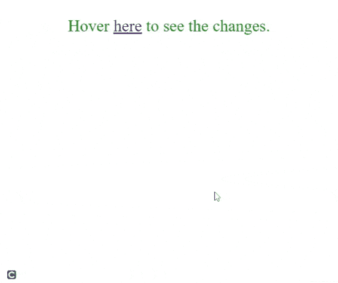

# 如何使用 jQuery 在鼠标悬停和点击时创建一个弹出 div？

> 原文:[https://www . geeksforgeeks . org/如何使用-jquery/](https://www.geeksforgeeks.org/how-to-create-a-pop-up-div-on-mouse-over-and-stay-when-click-using-jquery/) 创建点击时弹出鼠标并停留的 div

在本文中，我们将学习如何使用 jQuery 在 mouseover 上创建一个弹出 div，并在单击时保持不动。

**进场:**

*   首先，我们创建一个 HTML i div 元素，当我们将鼠标悬停在一个元素上并将其[**显示**属性](https://www.geeksforgeeks.org/css-display-property/)设置为*无*时，该元素将弹出。

```html
display:none;
```

*   在脚本标签中，我们创建了一个变量标志，并将其值设置为-1。

```html
 $flag = -1;
```

*   现在，在脚本标记中，我们将选择要将鼠标悬停在其上的元素。它是一个 HTML [**一个**](https://www.geeksforgeeks.org/html-a-tag/) 元素带类 *gfg。*我们用类 gfg 选择元素 *a* ，然后使用 [**悬停()**](https://www.geeksforgeeks.org/jquery-hover-with-examples/) 功能，该功能用于在我们将鼠标悬停在元素上时应用效果。
*   我们使用两个函数，第一个函数在*鼠标进入*事件发生时执行。我们用类*弹出菜单*选择 *div* ，并使用 jQuery**[**attr()**](https://www.geeksforgeeks.org/jquery-attr-method/)**将其*显示*属性设置为*块*。**当*鼠标离开*事件发生时，第二个功能执行，当标志不等于-1 时， *div* s *显示*值为 *none* 。**

****JavaScript 代码:****

```html
$("a.gfg").hover(
    function () {
        $("div.popup").attr("style", "display:block");
    },
    function () {
        if ($flag == -1) {
            $("div.popup").attr("style", "display:none");
        }
    }
);
```

*   **我们在元素**上添加一个 [**jQuery 点击**](https://www.geeksforgeeks.org/jquery-click-with-examples/) 事件一个**。当我们点击元素 **a 时，**函数将变量标志值设置为 1，因此 *div* 元素在点击后保持不变。**

```html
$("a.gfg").click(function () {
    $flag = 1;
});
```

****HTML 代码:**下面是上述方法的完整实现。**

## **超文本标记语言**

```html
<!DOCTYPE html>
<html>

<head>

    <!-- JQuery CDN -->
    <script src=
"https://ajax.googleapis.com/ajax/libs/jquery/3.5.1/jquery.min.js">
    </script>

    <style>
        center {
            font-size: 30px;
            color: green;
        }

        .popup {
            display: none;
            width: 500px;
            border: solid red 3px
        }
    </style>
</head>

<body>
    <center>
        <p>
            Hover <a href="#" class="gfg">here</a> 
            to see the changes.
        </p>

        <div class="popup">
            GeeksforGeeks
        </div>
    </center>

    <script>
        $flag = -1;

        $("a.gfg").hover(
            function () {
                $("div.popup").attr("style", "display:block");
            },
            function () {
                if ($flag == -1) {
                    $("div.popup").attr("style", "display:none");
                }
            }
        );

        $("a.gfg").click(function () {
            $flag = 1;
        });
    </script>
</body>

</html>
```

****输出:****

**

弹出鼠标悬停**