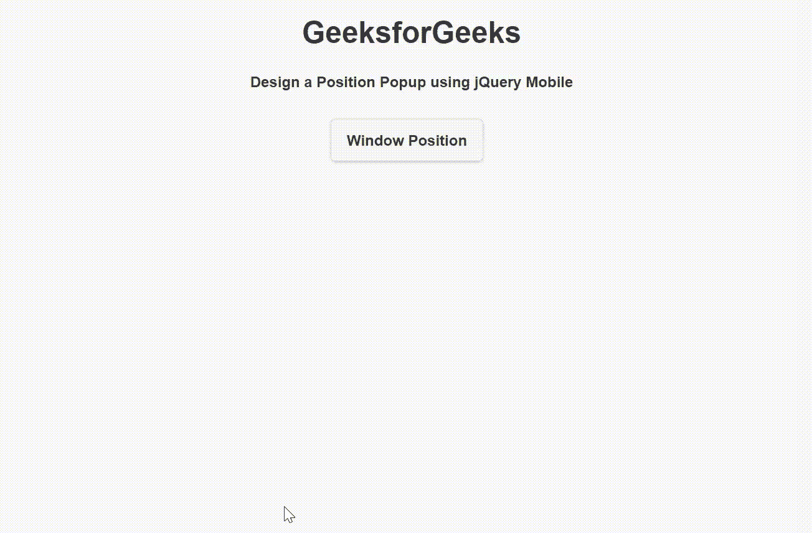

# 如何使用 jQuery Mobile 创建位置弹出窗口？

> 原文:[https://www . geeksforgeeks . org/如何创建位置-弹出-使用-jquery-mobile/](https://www.geeksforgeeks.org/how-to-create-a-position-popup-using-jquery-mobile/)

**jQuery Mobile** 是一种基于网络的技术，用于制作可在所有智能手机、平板电脑和台式机上访问的响应内容。在本文中，我们将使用 jQuery Mobile 创建一个位置*弹出窗口*。

**方法:**添加项目所需的 jQuery Mobile 脚本。

> <link rel="”stylesheet”" href="”http://code.jquery.com/mobile/1.4.5/jquery.mobile-1.4.5.min.css”">
> <脚本 src = " http://code . jquery . com/jquery-1 . 11 . 1 . min . js "></脚本>
> <脚本 src = " http://code . jquery . com/mobile/1 . 4 . 5/jquery . mobile-1 . 4 . 5 . min . js "></脚本>

默认情况下，弹出窗口在元素上垂直和水平居中打开。*数据-位置-至*属性用于设置窗口中居中的弹出窗口的位置。

**例 1:**

## 超文本标记语言

```html
<!DOCTYPE html>
<html>

<head>
    <link rel="stylesheet" href=
"http://code.jquery.com/mobile/1.4.5/jquery.mobile-1.4.5.min.css" />

    <script src=
        "http://code.jquery.com/jquery-1.11.1.min.js">
    </script>

    <script src=
"http://code.jquery.com/mobile/1.4.5/jquery.mobile-1.4.5.min.js">
    </script>
</head>

<body>
    <center>
        <h1>GeeksforGeeks</h1>
        <h4>
            Design a Position Popup using jQuery Mobile
        </h4>

        <a href="#WindowPosition" class="ui-btn ui-corner-all 
            ui-shadow ui-btn-inline" data-rel="popup"
            data-position-to="window">Window Position</a>

        <div data-role="popup" id="WindowPosition" 
            class="ui-content" data-theme="a">
            <p>The position of popup to center of window.</p>
        </div>
    </center>
</body>

</html>
```

**输出:**



**例 2:**

## 超文本标记语言

```html
<!DOCTYPE html>
<html>

<head>
    <link rel="stylesheet" href=
"http://code.jquery.com/mobile/1.4.5/jquery.mobile-1.4.5.min.css" />

    <script src=
        "http://code.jquery.com/jquery-1.11.1.min.js">
    </script>

    <script src=
"http://code.jquery.com/mobile/1.4.5/jquery.mobile-1.4.5.min.js">
    </script>
</head>

<body>
    <center>
        <h1>GeeksforGeeks</h1>
        <h4>
            Design a Position Popup using jQuery Mobile
        </h4>

        <a href="#OriginPosition" class="ui-btn ui-corner-all 
            ui-shadow ui-btn-inline" data-rel="popup" 
                data-position-to="origin">Origin Position</a>

        <div data-role="popup" id="OriginPosition" 
            class="ui-content" data-theme="a">
            <p>The position of popup to origin.</p>
        </div>
    </center>
</body>

</html>
```

**输出:**

